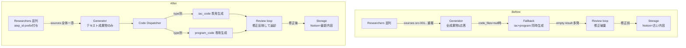
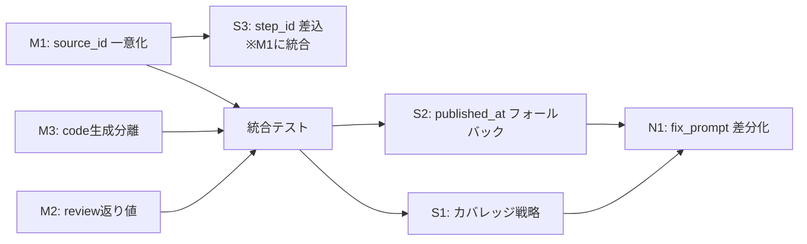

# 設計: 成果物品質問題の修正

## 設計方針

1. **根本原因を潰す**: 表面的な対処療法（例: UUID 上書き維持）ではなく、source_id の付番設計・review ループの戻り値設計・code 生成の分離設計を正す
2. **最小変更**: 既存のテーブルスキーマ・Slack UI・Notion 構造は変更しない
3. **可観測性を保つ**: 追加ログで fix が機能したかを CloudWatch で検証できるようにする
4. **独立に適用可能**: M1〜M3 は互いに独立に deploy 可能なよう設計し、片方失敗時の rollback リスクを抑える

## アーキテクチャ変更の全体像



## Fix 詳細設計

### M1: source_id のシステム全体一意化

#### 方針

`{step_id}:src-NNN` 形式へのリマップを **リサーチャー結果受領直後**（`_run_researchers` 戻り値合成時）に行う。これにより:
- 下流（ジェネレーター / レビュアー / Notion本文）が見る source_id は常に一意
- 本文内の `[r1-src-003]` 等の参照は DB の source_id と完全一致（トレーサビリティ確保）
- `dynamodb_client.py:132` の UUID 上書きを削除可能（DB schema = 本文参照）

#### 変更箇所

##### 1. `src/agent/orchestrator.py:453-472` `_execute_research` 内

研究結果を受け取った直後で source_id を step_id prefix で書き換える:

```python
def _execute_research(step: dict) -> dict:
    step_id = step["step_id"]
    self.db.update_step_status(execution_id, step_id, "running")
    try:
        prompt = (
            f"{researcher_prompt}\n\n"
            f"## 調査指示\n\n"
            f"あなたのステップID: {step_id}\n"    # 追加: step_id を渡す（Fix S3 兼用）
            f"カテゴリ: {category}\n"
            f"ステップ: {step['step_name']}\n"
            f"内容: {step['description']}\n"
            f"検索ヒント: {json.dumps(step.get('search_hints', []), ensure_ascii=False)}"
        )
        raw = call_claude(prompt, allowed_tools=["WebSearch", "WebFetch"])
        result = _parse_claude_response(raw)
        # 新規: source_id を step_id prefix で一意化
        _namespace_source_ids(result, step_id)
        self.db.update_step_status(execution_id, step_id, "completed", result)
        return result
    except Exception as e:
        ...
```

##### 2. `src/agent/orchestrator.py` にユーティリティ関数を新規追加

```python
def _namespace_source_ids(result: dict, step_id: str) -> None:
    """result 内の source_id を {step_id}:{source_id} 形式にリマップする（in-place）

    researcher が独立に src-001 から付番するため、統合時の重複を防ぐ。
    result.step_id 自体の誤りも補正する（Fix F）。
    """
    if not isinstance(result, dict):
        return
    result["step_id"] = step_id  # Fix F: LLMが誤った step_id を返すケースを補正
    sources = result.get("sources", [])
    if not isinstance(sources, list):
        return
    for src in sources:
        if isinstance(src, dict) and "source_id" in src:
            original = src["source_id"]
            src["source_id"] = f"{step_id}:{original}"
    # summary 本文中の [src-NNN] 参照は既存 researcher 出力に多くないため
    # 一次対応では書き換えないが、ジェネレーターには {step_id}:{source_id} で渡すため
    # ジェネレーターが新 ID で本文参照を生成する
```

##### 3. `src/agent/state/dynamodb_client.py:116-134` `put_sources` の改修

UUID 上書きを削除し、source_id の一意性をチェックする:

```python
def put_sources(self, execution_id: str, sources: list[dict]) -> None:
    """出典レコードを一括保存する

    source_id は呼び出し元で system-wide 一意化済み前提（step_id prefix）。
    同一 source_id / URL の重複は除外する。
    """
    table = self._table("sources")
    ttl = self._ttl_timestamp()
    seen_ids: set[str] = set()
    seen_urls: set[str] = set()
    with table.batch_writer() as batch:
        for source in sources:
            source_id = source.get("source_id", "")
            url = source.get("url", "")
            if not source_id:
                logger.warning("Skipping source without source_id", extra={"execution_id": execution_id})
                continue
            if source_id in seen_ids:
                continue
            if url and url in seen_urls:
                continue
            seen_ids.add(source_id)
            if url:
                seen_urls.add(url)
            item = dict(source)
            item["execution_id"] = execution_id
            item["ttl"] = ttl
            batch.put_item(Item=item)
```

##### 4. `src/agent/prompts/researcher.md` の出力例更新

例示 source_id を `src-001` のままにすると LLM が混乱するため、プロンプト側でも step_id prefix を使った例に変える:

```markdown
## 出力形式

以下のJSON形式で出力してください。
**重要**:
- あなたのステップID は指示で与えられます。source_id は `src-001, src-002, ...` の形式で付番してください。
- 統合時にシステム側で step_id prefix が付与されるため、あなたは src-001 から始めて問題ありません。
- step_id フィールドには必ず**指示で与えられたステップID**を設定してください。

\`\`\`json
{
  "step_id": "（指示で指定されたステップID）",
  "sources": [
    {"source_id": "src-001", ...}
  ]
}
\`\`\`
```

#### テスト影響

- `tests/test_dynamodb_client.py` の `test_put_sources_*` で UUID 上書き検証をしているテストを「source_id そのまま保存」に改修
- 新規テスト: `test_namespace_source_ids_applies_step_id_prefix` / `test_namespace_source_ids_corrects_wrong_step_id`

---

### M2: `_run_review_loop` の修正結果を永続化する

#### 方針

戻り値を `review_result` の単独 dict から **`(review_result, current_deliverables)`** のタプルに変更。呼び出し元で `deliverables` を更新してから storage に流す。

#### 変更箇所

##### 1. `src/agent/orchestrator.py:502-556` `_run_review_loop` シグネチャ変更

```python
def _run_review_loop(
    self,
    reviewer_prompt: str,
    deliverables: dict,
    sources: list[dict],
    category: str,
    gen_prompt: str,
    slack_channel: str,
    slack_thread_ts: str,
) -> tuple[dict, dict]:
    """レビューループを実行する（最大2回）

    Returns:
        (review_result, final_deliverables) - review_result は最後のレビュー結果、
        final_deliverables は修正を適用した最終的な成果物
    """
    current_deliverables = deliverables
    ...
    for loop in range(MAX_REVIEW_LOOPS + 1):
        ...
        if review_result.get("passed", False):
            return review_result, current_deliverables
        ...
        if not errors or loop >= MAX_REVIEW_LOOPS:
            ...
            return review_result, current_deliverables
        ...
        current_deliverables = _parse_claude_response(fix_raw)

    return review_result, current_deliverables
```

##### 2. `src/agent/orchestrator.py:352-355` 呼び出し元の修正

```python
review_result, deliverables = self._run_review_loop(
    reviewer_prompt, deliverables, all_sources, category, gen_prompt, slack_channel, slack_thread_ts
)
quality_metadata = review_result.get("quality_metadata", {})
```

#### 補足: 修正後 deliverables の妥当性確認

`current_deliverables = _parse_claude_response(fix_raw)` で parse_error になる可能性がある。その場合、古い deliverables のまま進めたい。`_run_review_loop` 内で:

```python
parsed = _parse_claude_response(fix_raw)
if parsed.get("parse_error"):
    logger.warning("Fix attempt produced unparseable response, keeping previous deliverables")
    # current_deliverables を更新せず、次ループは古い状態で review
else:
    current_deliverables = parsed
```

#### テスト影響

- `tests/test_orchestrator.py` で `_run_review_loop` の戻り値を mock していたテストを全て tuple 対応に変更
- 新規テスト: `test_run_review_loop_returns_fixed_deliverables` / `test_run_review_loop_keeps_previous_on_parse_error` / `test_run_integrates_fixed_deliverables_into_notion_content`

---

### M3: コード成果物生成を成果物タイプ別に完全分離

#### 方針

- 初回ジェネレーター呼び出し（`orchestrator.py:305-317`）から **code_files の要求を完全削除**
- `iac_code` / `program_code` がある場合、**型ごとに独立した専用プロンプト呼び出し** を常に実行
- ジェネレーターは `content_blocks` と `summary` のみ返す軽量応答

#### 変更箇所

##### 1. `src/agent/prompts/generator.md` の改修

`code_files` の記述セクションを削除し、出力形式を以下に簡素化:

```json
{
  "content_blocks": [...],
  "summary": "..."
}
```

##### 2. `src/agent/orchestrator.py` にタイプ別コード生成ヘルパー新設

現状の `_build_code_generation_prompt` を、タイプ 1つ受け取る関数にリファクタ:

```python
def _build_code_generation_prompt(
    topic: str,
    category: str,
    research_results: list[dict],
    profile_text: str,
    code_type: str,  # "iac_code" or "program_code"
) -> str:
    """単一コードタイプの生成プロンプトを構築する"""
    code_type_labels = {
        "iac_code": "IaCコード（Terraform または CloudFormation）",
        "program_code": "プログラムコード（Python またはユーザープロファイルの技術スタック）",
    }
    label = code_type_labels[code_type]
    research_summary = "..."  # 既存ロジック流用

    return (
        "# コード成果物生成\n\n"
        f"## 依頼\n以下のトピックの{label}のみを生成してください。\n"
        f"トピック: {topic}\n"
        f"カテゴリ: {category}\n"
        f"ユーザープロファイル:\n{profile_text}\n\n"
        "## 調査結果サマリー\n"
        f"{research_summary}\n\n"
        "## 出力形式\n"
        "```json\n"
        '{\n'
        '  "files": {"ファイルパス": "ファイル内容"},\n'
        '  "readme_content": "README.md本文"\n'
        '}\n'
        "```\n\n"
        "## 制約\n"
        "- ファイル数は最大5ファイル\n"
        "- ハードコードされたシークレット禁止\n"
        "- PoC品質であることを冒頭コメントで明示\n"
    )
```

##### 3. `src/agent/orchestrator.py:305-341` の改修

```python
# 5. ジェネレーター起動（テキスト成果物のみ）
self.db.update_execution_status(execution_id, "generating")
self.slack.post_progress(slack_channel, slack_thread_ts, "📝 成果物を生成中...")

generator_prompt = _load_prompt("generator")
combined_research = json.dumps(research_results, ensure_ascii=False)
gen_prompt = (
    f"{generator_prompt}\n\n"
    f"## 成果物を生成してください\n\n"
    f"トピック: {topic}\n"
    f"カテゴリ: {category}\n\n"
    f"ワークフロー計画:\n```json\n{json.dumps(workflow, ensure_ascii=False)}\n```\n\n"
    f"調査結果:\n```json\n{combined_research}\n```\n\n"
    f"ユーザープロファイル:\n{profile_text}"
)
gen_raw = call_claude(gen_prompt)
deliverables = _parse_claude_response(gen_raw)

# 5b. コード成果物のタイプ別独立生成
generate_step_types = [s.get("deliverable_type") for s in workflow.get("generate_steps", [])]
code_types = [t for t in generate_step_types if t in ("iac_code", "program_code")]
if code_types and "github" in storage_targets:
    code_files_merged: dict[str, str] = {}
    readme_parts: list[str] = []
    for code_type in code_types:
        self.slack.post_progress(
            slack_channel, slack_thread_ts, f"⚙️ {code_type} を生成中..."
        )
        code_raw = call_claude(
            _build_code_generation_prompt(topic, category, research_results, profile_text, code_type)
        )
        code_result = _parse_claude_response(code_raw)
        if isinstance(code_result, dict) and code_result.get("files"):
            code_files_merged.update(code_result["files"])
            if code_result.get("readme_content"):
                readme_parts.append(code_result["readme_content"])
            logger.info(
                "Code files generated",
                extra={"execution_id": execution_id, "code_type": code_type,
                       "files_count": len(code_result["files"])},
            )
        else:
            logger.warning(
                "Code generation failed for type",
                extra={"execution_id": execution_id, "code_type": code_type},
            )
    if code_files_merged:
        deliverables["code_files"] = {
            "files": code_files_merged,
            "readme_content": "\n\n---\n\n".join(readme_parts),
        }
```

#### テスト影響

- `tests/test_orchestrator.py` の既存 code_files フォールバックテストを「常に個別生成」パスに修正
- 新規テスト: `test_code_generation_per_type_merges_files` / `test_code_generation_partial_failure_keeps_successful_types`

---

### S1: レビュアーの検証カバレッジ戦略

#### 方針

`reviewer.md` にサンプリング戦略を明記。サンプリング済みの分母を `sources_total` として品質情報に追加し、「3/49 検証」のように明示する。

#### 変更箇所

##### 1. `src/agent/prompts/reviewer.md` に追加

```markdown
### 検証カバレッジ方針

出典数が多い場合、全件の WebFetch は非現実的です。以下の戦略で検証対象を選定してください:

1. **Priority 1 ソース（公式ドキュメント等）を最優先**
2. **本文で直接引用・数値参照されている出典を必須**
3. **最低 30% または 10 件のうち多い方**を検証
4. **上限 15 件**（時間・コスト制約）

検証しなかった出典は `sources_verified` からは除外し、`sources_total` で分母として明示してください。
```

##### 2. `reviewer.md` の quality_metadata 出力例に `sources_total` を追加

```json
{
  "quality_metadata": {
    "sources_verified": 12,
    "sources_total": 49,
    "sources_unverified": 2,
    ...
  }
}
```

##### 3. `src/agent/orchestrator.py:558-589` `_build_quality_metadata_block` の表示改修

```python
total = metadata.get("sources_total", verified + unverified)
lines.append(f"検証ステータス: ✅ 出典検証済み: {verified}/{total} 件")
```

#### テスト影響

- `tests/test_orchestrator.py::test_build_quality_metadata_block_*` に sources_total 分岐テスト追加

---

### S2: `published_at` 欠損時のフォールバック

#### 方針

リサーチャーに `published_at` 取得不能時の代替値を指示。`_build_quality_metadata_block` でも null / unknown を区別して表示する。

#### 変更箇所

##### 1. `src/agent/prompts/researcher.md` に追記

```markdown
### published_at の扱い

- ページに公開日・最終更新日が明記されている場合: ISO 8601 日付（`"2026-01-15"`）
- 取得できない場合: `"unknown"` 文字列
- ページに「AWS公式ドキュメント」等、継続更新で日付の意味が薄いと判断した場合: `"continuously-updated"` 文字列

**`null` は使用しない**こと。
```

##### 2. `src/agent/orchestrator.py:558-589` の鮮度表示改修

```python
newest = metadata.get("newest_source_date")
oldest = metadata.get("oldest_source_date")
if not newest or newest in ("unknown", "continuously-updated"):
    freshness_line = "情報の鮮度: 取得日不明のソースが含まれます"
else:
    freshness_line = f"情報の鮮度: 最新 {newest} / 最古 {oldest or 'N/A'}"
lines.append(freshness_line)
```

##### 3. `src/agent/prompts/reviewer.md` に集計ルール追記

```markdown
### newest_source_date / oldest_source_date

- `published_at` が日付文字列の出典のみから最新・最古を算出
- 日付情報を持つ出典が1件もない場合: `null` を設定
```

#### テスト影響

- `tests/test_orchestrator.py` の `_build_quality_metadata_block` 鮮度表示テストを拡張

---

### S3: リサーチャープロンプトに実 step_id を差し込む（M1 に統合）

M1 で実装済み（`あなたのステップID: {step_id}` を prompt に追加 + `_namespace_source_ids` 内で `result["step_id"] = step_id` 補正）。独立の fix としては扱わない。

---

### N1: `fix_prompt` の差分修正化（任意）

#### 方針

現状は `gen_prompt` 全体を再送して「全成果物再生成」→ 応答が巨大化しやすい。修正の対象範囲を絞った差分修正プロンプトにする。

#### 変更箇所

##### `src/agent/orchestrator.py:546-554`

```python
fix_prompt = (
    "# 成果物の部分修正\n\n"
    "以下のレビュー指摘に基づき、成果物のうち該当する**content_blocks のみ**を修正して返してください。\n"
    "成果物全体を再生成する必要はありません。\n\n"
    f"指摘事項:\n```json\n{fix_instructions}\n```\n\n"
    f"現在の成果物:\n```json\n{json.dumps(current_deliverables, ensure_ascii=False)}\n```\n\n"
    "## 出力形式\n"
    "修正後の成果物全体を同じ JSON 形式（content_blocks + summary + code_files があれば code_files）で返してください。\n"
)
```

ただし、Claude が「差分だけ返す」指示を守らず全再生成する可能性があるため、**優先度は低** とし、M1-M3 完了後に様子見で実施する。

#### テスト影響

軽微（fix_prompt の文字列チェックテスト追加）。

---

## 実装順序と依存関係



- **M1 → M2 → M3 は独立**。並行で実装可能だが、ひとつずつ PR を分けてリスク低減
- **S1, S2 は M 完了後**。M3 で大きく変わる箇所には触らない
- **N1 は最後**。効果が不確実なため後回し

## データフロー変更の要点

### Before

```
Researchers → sources (src-001 重複) → Generator (全成果物1応答, code_files=null) →
  Fallback (iac+program 1応答, 失敗) → Review loop (修正を破棄) →
  Storage (初回gen のまま Notion、GitHub なし)
```

### After

```
Researchers → sources (step-id:src-NNN 一意) → Generator (content_blocks のみ軽量応答) →
  Per-type code generator × N → merge → Review loop (修正を戻り値で反映) →
  Storage (修正後を Notion、型別コードを GitHub)
```

## ロールバック戦略

各 Must 修正は単独で revert 可能:
- M1: `_namespace_source_ids` と `dynamodb_client.put_sources` を元に戻せば旧挙動
- M2: `_run_review_loop` の signature を dict 戻しに戻せば旧挙動
- M3: `generator.md` と `orchestrator.py` のコード生成ブロックを戻せば旧挙動

Git 上で個別 commit にすることで、deploy 後問題発覚時の切り戻しを容易にする。

## 可観測性

修正の効果確認用に以下のログを追加:
- `_namespace_source_ids` 実行時: `"Source IDs namespaced"` with {step_id, count}
- タイプ別 code generation 成功時: `"Code files generated"` with {code_type, files_count}
- review loop で deliverables を更新: `"Deliverables updated by review fix"` with {loop, issues_fixed}

CloudWatch Logs Insights で以下のクエリを想定:

```
fields @timestamp, @message
| filter @message like /Code files generated|Source IDs namespaced|Deliverables updated/
| sort @timestamp asc
```

## 非機能要件への影響

| 項目 | 影響 |
|------|------|
| 実行時間 | M3 により Claude CLI 呼び出しが +1〜2 回増える（推定 +3〜5分）。ただし fallback 失敗時の再試行と比較すれば同等以下 |
| コスト | 同上。Opus 呼び出し数は review loop 分のみなので変化なし |
| DB 容量 | sources テーブルの source_id が `step_id:src-NNN` で長くなる（+20B/item 程度）。影響軽微 |
| 下位互換 | DynamoDB スキーマ無変更。既存実行レコード（UUID source_id）はそのまま読める |
