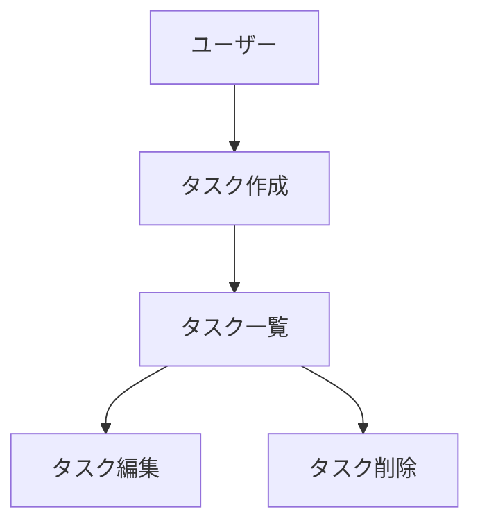

# CLAUDE.md (プロジェクトメモリ)

## 概要
開発を進めるうえで遵守すべき標準ルールを定義します。

## プロジェクト構造

### ドキュメントの分類

#### 1. 永続的ドキュメント（`docs/`）

アプリケーション全体の「**何を作るか**」「**どう作るか**」を定義する恒久的なドキュメント。
アプリケーションの基本設計や方針が変わらない限り更新されません。

- **product-requirements.md** - プロダクト要求定義書
  - プロダクトビジョンと目的
  - ターゲットユーザーと課題・ニーズ
  - 主要な機能一覧
  - 成功の定義
  - ビジネス要件
  - ユーザーストーリー
  - 受け入れ条件
  - 機能要件
  - 非機能要件

- **functional-design.md** - 機能設計書
  - 機能ごとのアーキテクチャ
  - システム構成図
  - データモデル定義（ER図含む）
  - コンポーネント設計
  - ユースケース図、画面遷移図、ワイヤフレーム
  - API設計（将来的にバックエンドと連携する場合）

- **architecture.md** - 技術仕様書
  - テクノロジースタック
  - 開発ツールと手法
  - 技術的制約と要件
  - パフォーマンス要件

- **repository-structure.md** - リポジトリ構造定義書
  - フォルダ・ファイル構成
  - ディレクトリの役割
  - ファイル配置ルール

- **development-guidelines.md** - 開発ガイドライン
  - コーディング規約
  - 命名規則
  - スタイリング規約
  - テスト規約
  - Git規約

- **glossary.md** - ユビキタス言語定義
  - ドメイン用語の定義
  - ビジネス用語の定義
  - UI/UX用語の定義
  - 英語・日本語対応表
  - コード上の命名規則


#### 2. 作業単位のドキュメント（`.steering/[YYYYMMDD]-[開発タイトル]/`）

特定の開発作業における「**今回何をするか**」を定義する一時的なステアリングファイル。
作業完了後は参照用として保持されますが、新しい作業では新しいディレクトリを作成します。

- **requirements.md** - 今回の作業の要求内容
  - 変更・追加する機能の説明
  - ユーザーストーリー
  - 受け入れ条件
  - 制約事項

- **design.md** - 変更内容の設計
  - 実装アプローチ
  - 変更するコンポーネント
  - データ構造の変更
  - 影響範囲の分析

- **tasklist.md** - タスクリスト
  - 具体的な実装タスク
  - タスクの進捗状況
  - 完了条件

### ステアリングディレクトリの命名規則

```
.steering/[YYYYMMDD]-[開発タイトル]/
```

**例：**
- `.steering/20250103-initial-implementation/`
- `.steering/20250115-add-tag-feature/`
- `.steering/20250120-fix-filter-bug/`
- `.steering/20250201-improve-performance/`

## 開発プロセス

### 初回セットアップ時の手順

#### 1. フォルダ作成
```bash
mkdir -p docs
mkdir -p .steering
```

#### 2. 永続的ドキュメント作成（`docs/`）

アプリケーション全体の設計を定義します。
各ドキュメントを作成後、必ず確認・承認を得てから次に進みます。

1. `docs/product-requirements.md` - プロダクト要求定義書
2. `docs/functional-design.md` - 機能設計書
3. `docs/architecture.md` - 技術仕様書
4. `docs/repository-structure.md` - リポジトリ構造定義書
5. `docs/development-guidelines.md` - 開発ガイドライン
6. `docs/glossary.md` - ユビキタス言語定義

**重要：** 1ファイルごとに作成後、必ず確認・承認を得てから次のファイル作成を行う

#### 3. 初回実装用のステアリングファイル作成

初回実装用のディレクトリを作成し、実装に必要なドキュメントを配置します。

```bash
mkdir -p .steering/[YYYYMMDD]-initial-implementation
```

作成するドキュメント：
1. `.steering/[YYYYMMDD]-initial-implementation/requirements.md` - 初回実装の要求
2. `.steering/[YYYYMMDD]-initial-implementation/design.md` - 実装設計
3. `.steering/[YYYYMMDD]-initial-implementation/tasklist.md` - 実装タスク

#### 4. 環境セットアップ

#### 5. 実装開始

`.steering/[YYYYMMDD]-initial-implementation/tasklist.md` に基づいて実装を進めます。

#### 6. 品質チェック

### 機能追加・修正時の手順

#### 1. 影響分析

- 永続的ドキュメント（`docs/`）への影響を確認
- 変更が基本設計に影響する場合は `docs/` を更新

#### 2. ステアリングディレクトリ作成

新しい作業用のディレクトリを作成します。

```bash
mkdir -p .steering/[YYYYMMDD]-[開発タイトル]
```

**例：**
```bash
mkdir -p .steering/20250115-add-tag-feature
```

#### 3. 作業ドキュメント作成

作業単位のドキュメントを作成します。
各ドキュメント作成後、必ず確認・承認を得てから次に進みます。

1. `.steering/[YYYYMMDD]-[開発タイトル]/requirements.md` - 要求内容
2. `.steering/[YYYYMMDD]-[開発タイトル]/design.md` - 設計
3. `.steering/[YYYYMMDD]-[開発タイトル]/tasklist.md` - タスクリスト

**重要：** 1ファイルごとに作成後、必ず確認・承認を得てから次のファイル作成を行う

#### 4. 永続的ドキュメント更新（必要な場合のみ）

変更が基本設計に影響する場合、該当する `docs/` 内のドキュメントを更新します。

#### 5. 実装開始

`.steering/[YYYYMMDD]-[開発タイトル]/tasklist.md` に基づいて実装を進めます。

#### 6. 品質チェック

## ドキュメント管理の原則

### 永続的ドキュメント（`docs/`）
- アプリケーションの基本設計を記述
- 頻繁に更新されない
- 大きな設計変更時のみ更新
- プロジェクト全体の「北極星」として機能

### 作業単位のドキュメント（`.steering/`）
- 特定の作業・変更に特化
- 作業ごとに新しいディレクトリを作成
- 作業完了後は履歴として保持
- 変更の意図と経緯を記録

## 図表・ダイアグラムの記載ルール

### 記載場所
設計図やダイアグラムは、関連する永続的ドキュメント内に直接記載します。
独立したdiagramsフォルダは作成せず、手間を最小限に抑えます。

**配置例：**
- ER図、データモデル図 → `functional-design.md` 内に記載
- ユースケース図 → `functional-design.md` または `product-requirements.md` 内に記載
- 画面遷移図、ワイヤフレーム → `functional-design.md` 内に記載
- システム構成図 → `functional-design.md` または `architecture.md` 内に記載

### 記述形式
1. **Mermaid記法（推奨）**
   - Markdownに直接埋め込める
   - バージョン管理が容易
   - ツール不要で編集可能



2. **ASCII アート**
   - シンプルな図表に使用
   - テキストエディタで編集可能

```
┌─────────────┐
│   Header    │
└─────────────┘
       │
       ↓
┌─────────────┐
│  Task List  │
└─────────────┘
```

3. **画像ファイル（必要な場合のみ）**
   - 複雑なワイヤフレームやモックアップ
   - `docs/images/` フォルダに配置
   - PNG または SVG 形式を推奨

### 図表の更新
- 設計変更時は対応する図表も同時に更新
- 図表とコードの乖離を防ぐ

## 注意事項

- ドキュメントの作成・更新は段階的に行い、各段階で承認を得る
- `.steering/` のディレクトリ名は日付と開発タイトルで明確に識別できるようにする
- 永続的ドキュメントと作業単位のドキュメントを混同しない
- コード変更後は必ずリント・型チェックを実施する
- 共通のデザインシステム（Tailwind CSS）を使用して統一感を保つ
- セキュリティを考慮したコーディング（XSS対策、入力バリデーションなど）
- 図表は必要最小限に留め、メンテナンスコストを抑える

## 作業規律

セッション中の行動規範。成果物（docs / .steering）とは別に、Claude の挙動そのものを縛るルール。

### 1. 検証の基準（Verification Standards）

「完了」と報告してよいのは、観測した事実がある場合のみ。

- **デプロイ完了 ≠ 機能検証**
  - `sam deploy` 成功 / CI pass / exit code 0 は「動いた」根拠にならない
  - CloudWatch Logs の実出力、エンドポイント実呼び出し、UI の実画面のいずれかで挙動を確認してから報告する
- **artifact の実反映を確認**
  - `sam deploy` 後は CloudFormation Outputs か ECS task definition で image SHA / version が更新されたことを確認
  - フロントは S3 sync 後の CloudFront invalidation 完了まで含めて検証
- **報告フォーマット**
  - 「verified」と書く場合は (1) 受け入れ基準、(2) 各基準の根拠（コマンド / ログ / URL）、(3) 未検証で推測している項目 を明示する
  - (3) に該当するものは「verified」と呼ばない

### 2. ステアリングワークフロー（Steering Workflow）

機能追加・修正は必ず steering 経由で行う。

- **承認順序の厳守**
  - `requirements.md` → ユーザー承認 → `design.md` → ユーザー承認 → `tasklist.md` → ユーザー承認 → 実装
  - 前段の承認なしに次のファイルを作成しない
- **再発バグエリアの扱い**
  - 同じ症状を過去に修正した領域（例: `_run_review_loop`、Slack Modal 入力）では、まずプロジェクトメモリと過去 steering を検索する
  - 提案する修正が「症状パッチ」か「構造修正」かを明示してから推奨する
  - 症状パッチを選ぶ場合は理由（時間制約 / 影響範囲）を書く

### 3. セッションハンドオフ（Session Handoff）

トークン消費が高まったら、ユーザーが指示する前にハンドオフを完了させる。

- **トリガ**: 残コンテキストが体感で残り少ない / 自然な区切り / ユーザーの「終わる」発言
- **更新ファイル**: `/home/vscode/.claude/projects/-workspaces-Catch-Expander/memory/project_YYYY-MM-DD-session-end.md`
- **必須 4 項目**:
  1. 完了作業（commit hash + 1 行要約）
  2. 現在の状態（HEAD、デプロイ revision、working tree clean か）
  3. 次候補タスク（具体的な再開ポイント）
  4. ブロッカー / pre-existing failure
- 既存のセッション終端メモ（`project_2026-05-1*-session-end.md`）を雛形にする

### 4. Codex レビューゲート（Codex Review Gate）

コード変更を伴うコミット後は、Codex レビューを挟むまで次の build / deploy に進まない。

- **タイミング**: `git push` 完了直後
- **手順**:
  1. `.audit/YYYY-MM-DD_<topic>.prompt.md` にレビュー観点を書いた prompt を用意
  2. `.audit/YYYY-MM-DD_<topic>.md` を結果保存先として準備
  3. ユーザーに「Codex レビューを回す承認」を求めて停止
  4. 承認後のみ手動 `codex -c sandbox_mode="danger-full-access"` を実行（companion 経由は WSL2 で hang する）
- **連続レビュー**: 1 pass 完了後に「2 pass 目を回すか」を必ず確認、承認なしで連続自動実行しない
- **build / deploy**: Codex 指摘ゼロが確認できた後、ユーザーの明示承認をもらってから `sam build` / `sam deploy` を実行
