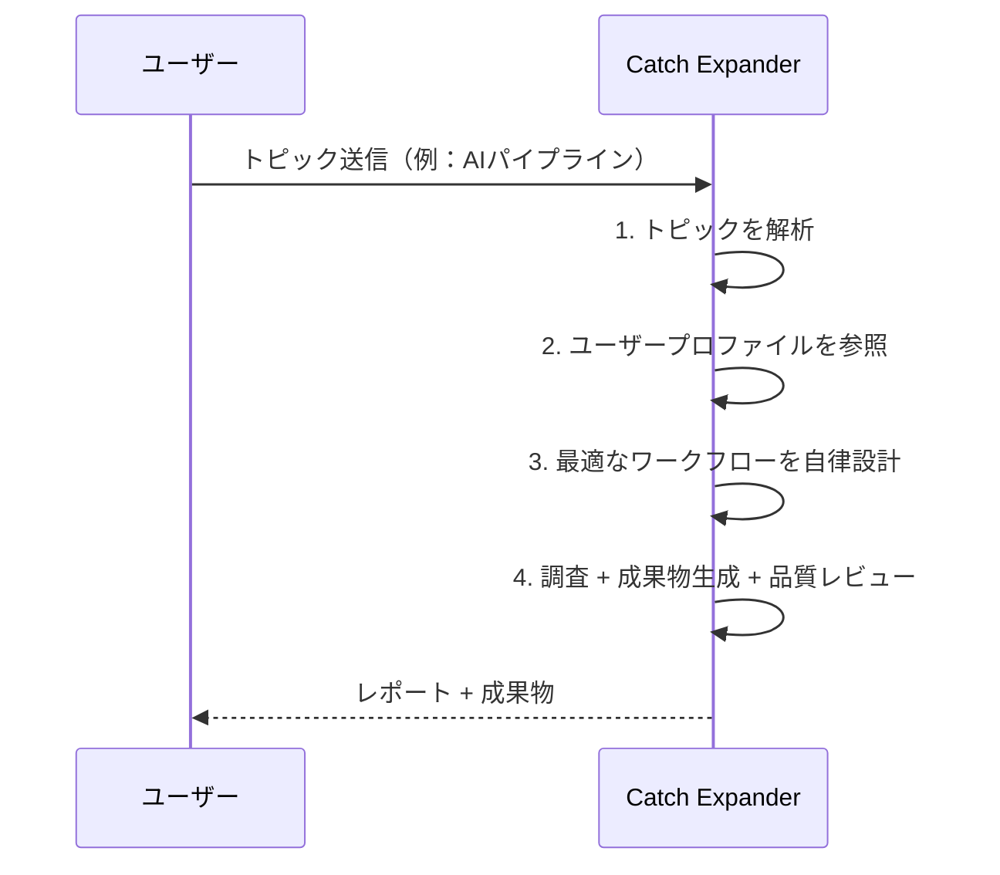

# Catch-Expander

ユーザーの「気になる」をキャッチし、AI エージェントが自律的に思考・調査・構成して、そのトピックに最適な成果物（レポート / IaC コード / 設計書 / 比較表 など）まで拡張（**Expand**）するワークフロー自動化システム。

Slack でトピックを送信すると、マルチ AI エージェントが調査・成果物生成・品質レビューを自動実行し、Notion / GitHub に成果物を格納する。実行状況は専用ダッシュボードでブラウザから可視化できる。

## コアコンセプト: Catch → Expand

ユーザーは「**何を調べるか**」「**何を作るか**」を指示しない。エージェントがトピックとユーザープロファイルから判断し、毎回異なるワークフローを組み立てる。



## 主要機能

| # | 機能 | 概要 |
|---|------|------|
| F1 | Slack 入出力 | トピック受信・進捗通知・完了通知をスレッドで集約 |
| F2 | トピック解析 | 入力の意図・カテゴリ・深掘り観点・必要な成果物タイプを自律判定 |
| F3 | 自律ワークフロー構築 | トピック × ユーザーに最適な調査・成果物作成手順を AI が設計 |
| F4 | 情報収集 | Claude Code CLI 組み込み WebSearch / WebFetch による収集・要約 |
| F5 | 成果物生成 | レポート / IaC / プログラムコード / 設計書 / 比較表 をトピックに応じた形式で出力 |
| F6 | ユーザープロファイル | ロール・担当クラウド・技術スタック・関心領域を成果物に反映 |
| F7 | 品質担保 | ソース検証 → カテゴリ別セルフレビュー → 品質メタデータ付与の3層 |
| F8 | フィードバック学習 | 完了スレッドへの自由テキスト返信から好みを抽出し次回以降に反映 |
| F9 | 成果物履歴管理 | Slack `履歴` / `history [keyword]` コマンドで過去成果物を再参照 |

## ダッシュボード

ワークフロー実行状況をブラウザで確認できるオブザービリティダッシュボード。Slack ワークスペースの OAuth ログインで認証し、JWT Cookie + Lambda Authorizer 経由で API へアクセスする。

### 画面一覧

| 画面 | 内容 |
|------|------|
| ダッシュボードホーム | 実行件数・成功率・トークン消費・コスト推移・レビュー通過率（ドーナツチャート） |
| 実行一覧 | フィルタ / ソート可能な実行リスト |
| 実行詳細 | ステップ別ログ・サブエージェント I/O・成果物リンク・イベントタイムライン |
| レビュー品質 | 第1〜3層の検証結果集計 |
| エラー一覧 | 失敗実行の絞り込み・原因表示 |
| フィードバック分析 | F8 で蓄積された learned_preferences の可視化 |

## リポジトリ構成

```
Catch-Expander/
├── docs/                  # 永続的ドキュメント（要求 / 機能 / 技術仕様 / ガイドライン）
├── .steering/             # 作業単位のステアリングファイル
├── src/
│   ├── trigger/           # Slack イベント受信 Lambda
│   ├── token_monitor/     # Claude OAuth リフレッシュ Lambda
│   ├── observability/     # 観測イベント共通ヘルパー
│   ├── dashboard_api/     # ダッシュボード API Lambda 群（認証 + メトリクス）
│   └── agent/             # ECS エージェント本体（Claude Code CLI + オーケストレーター）
├── frontend/              # ダッシュボード SPA（Vite + React 19）
├── scripts/               # デプロイスクリプト（deploy-agent.sh 等）
├── tests/                 # 単体テスト
├── template.yaml          # SAM テンプレート（IaC）
├── samconfig.toml         # SAM デプロイ設定
└── CLAUDE.md              # プロジェクト標準ルール
```

## デプロイ

### バックエンド（SAM）

```bash
sam build
sam deploy
```

### エージェントコンテナ（ECR + SAM）

```bash
./scripts/deploy-agent.sh
```

git の HEAD コミット SHA をタグとして ECR に push し、その SHA を `AgentImageUri` に渡して `sam deploy` する。ECR は IMMUTABLE 設定のため、同じ SHA を 2 回 push するとエラーになる。

### フロントエンド SPA

```bash
cd frontend
npm ci
npm run build
aws s3 sync dist/ s3://catch-expander-frontend-{account}/ --delete
aws cloudfront create-invalidation --distribution-id <ID> --paths "/index.html"
```

> **注意**: フロントエンドは SAM とは別経路でデプロイする。`sam deploy` だけでは S3 上のバンドルは更新されない。

詳細は [`docs/architecture.md`](docs/architecture.md) 9. デプロイ設計を参照。

## ドキュメント

| ファイル | 内容 |
|---------|------|
| [product-requirements.md](docs/product-requirements.md) | プロダクト要求定義書 |
| [functional-design.md](docs/functional-design.md) | 機能設計書（ER 図 / シーケンス / ユースケース） |
| [architecture.md](docs/architecture.md) | 技術仕様書（インフラ構成 / IAM / コスト） |
| [credential-setup.md](docs/credential-setup.md) | クレデンシャル取得手順 |
| [repository-structure.md](docs/repository-structure.md) | リポジトリ構造定義書 |
| [development-guidelines.md](docs/development-guidelines.md) | 開発ガイドライン |
| [glossary.md](docs/glossary.md) | ユビキタス言語定義 |

## ライセンス

個人利用。
