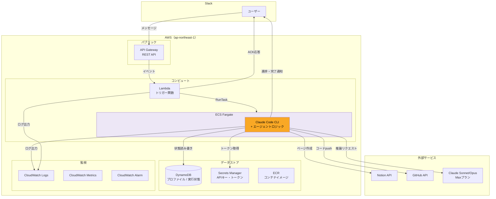

# 技術仕様書

## 1. テクノロジースタック

### 実行基盤

| レイヤー | 技術 | 用途 |
|---------|------|------|
| エージェント実行 | ECS Fargate | Claude Code CLIを実行するコンテナ |
| トリガー | AWS Lambda | Slackイベント受信 → ECSタスク起動 |
| トークンモニター | AWS Lambda + EventBridge Scheduler | Claude OAuth トークン失効の定期監視 |
| APIエンドポイント | Amazon API Gateway（REST API） | Slackイベントの受信・署名検証 |
| 状態管理 | Amazon DynamoDB | ワークフロー実行状態・ユーザープロファイルの永続化 |
| シークレット管理 | AWS Secrets Manager | APIキー・トークンの安全な保管 |
| コンテナレジストリ | Amazon ECR | ECSタスク用Dockerイメージの管理 |

### エージェント基盤

| 項目 | 技術 |
|------|------|
| エージェントフレームワーク | Claude Code CLI |
| LLMモデル | Claude Sonnet 4.6（通常ステップ）/ Claude Opus 4.6（品質レビューのみ） |
| LLMプラン | Maxプラン（月額固定） |
| 認証 | MaxプランOAuth（Claude Code公式アプリケーション経由） |
| Web検索 | Claude Code組み込み WebSearch / WebFetch |
| サブエージェント管理 | `claude -p` のサブプロセス呼び出し（ThreadPoolExecutorで並列制御） |

選定の詳細は `knowledge/agent-runtime-selection.md` を参照。

### 外部サービス

| サービス | 用途 | 認証方式 |
|---------|------|---------|
| Slack API | ユーザー入力受付・進捗通知・完了通知 | Bot Token（`xoxb-`） |
| Notion API | 成果物ページの作成・更新 | Integration Token |
| GitHub API | コード成果物のpush | Fine-grained PAT（`contents: write`） |

### 言語・ランタイム

| コンポーネント | 言語 | ランタイム |
|--------------|------|-----------|
| Lambda（トリガー） | Python 3.13 | AWS Lambda |
| ECSタスク（エージェント実行） | Node.js（Claude Code CLI） + Python（ラッパースクリプト） | ECS Fargate |

## 2. インフラストラクチャ構成

### 全体構成図



### ネットワーク構成

| 項目 | 設定 |
|------|------|
| VPC | 使用する（パブリックサブネットのみ） |
| サブネット | パブリックサブネット × 2 AZ |
| ECS Fargate | パブリックサブネット + パブリックIP割り当て |
| Lambda | VPC外（デフォルト、AWSマネージドネットワーク） |
| 外部API通信 | インターネット経由（HTTPS） |
| セキュリティグループ | インバウンド: 全拒否 / アウトバウンド: HTTPS（443）のみ |

#### パブリックサブネット構成の採用理由

ECSタスクは外部API（Slack, Notion, GitHub, Claude）へのアウトバウンド通信のみ行い、インバウンド通信は不要。LambdaからECSへの起動は`RunTask` API（AWSコントロールプレーン経由）であり、コンテナへの直接通信は発生しない。

プライベートサブネット + NAT Gatewayは月額~$32のコストが追加されるが、セキュリティグループでインバウンドを全拒否し、Fargateタスクがタスク実行中のみ起動する（パブリックIPもタスク終了で消滅する）本構成では、NAT Gatewayによる追加のネットワーク隔離の効果は限定的であり、コストに見合わない。

### リージョン

| 項目 | リージョン | 理由 |
|------|-----------|------|
| 全AWSリソース | ap-northeast-1（東京） | ユーザーの所在地に最も近い |

## 3. コンテナ設計

### Dockerイメージ構成

```dockerfile
FROM node:22-slim

# 非rootユーザー作成
RUN groupadd -r appuser && useradd -r -g appuser -m appuser

# Claude Code CLIのインストール
RUN npm install -g @anthropic-ai/claude-code

# Python（ラッパースクリプト用）
RUN apt-get update && apt-get install -y --no-install-recommends python3 python3-pip \
    && rm -rf /var/lib/apt/lists/*

# アプリケーションコード
COPY src/agent/ /app/
WORKDIR /app

# Python依存パッケージ
RUN pip3 install --no-cache-dir -r requirements.txt --break-system-packages

# 非rootユーザーで実行
USER appuser

ENTRYPOINT ["python3", "main.py"]
```

### ECSタスク定義

| 項目 | 値 | 備考 |
|------|-----|------|
| CPU | 1 vCPU | Claude Code CLI + サブエージェント並列実行 |
| メモリ | 2 GB | 複数サブエージェントの同時実行に対応 |
| プラットフォーム | Linux/ARM64 | Gravitonでコスト最適化 |
| タスクロール | ECSTaskRole | DynamoDB, Secrets Manager, CloudWatch Logsへのアクセス |
| 実行ロール | ECSTaskExecutionRole | ECRからのイメージ取得 |
| ログドライバー | awslogs | CloudWatch Logsへ出力 |

### 環境変数

#### タスク定義の環境変数（固定値）

| 変数名 | 値のソース | 用途 |
|--------|-----------|------|
| `NOTION_DATABASE_ID` | タスク定義 | 成果物DBのID |
| `GITHUB_REPO` | タスク定義 | コード成果物リポジトリ名 |
| `DYNAMODB_TABLE_PREFIX` | タスク定義 | DynamoDBテーブル名のプレフィックス |

#### ランタイム環境変数（Lambda → ECSタスク起動時に設定）

| 変数名 | 値のソース | 用途 |
|--------|-----------|------|
| `EXECUTION_ID` | Lambda（生成） | ワークフロー実行ID |
| `USER_ID` | Lambda（Slackイベントから取得） | Slack User ID |
| `TOPIC` | Lambda（Slackイベントから取得） | トピックテキスト |
| `SLACK_CHANNEL` | Lambda（Slackイベントから取得） | 通知先チャンネルID |
| `SLACK_THREAD_TS` | Lambda（ACK応答のレスポンスから取得） | ACKメッセージのthread_ts |

#### シークレット（main.pyが起動時にSecrets Managerから取得）

| シークレット | Secrets Manager名 | 用途 |
|------------|-------------------|------|
| Slack Bot Token | `catch-expander/slack-bot-token` | Slack通知の送信 |
| Notion Token | `catch-expander/notion-token` | Notion APIアクセス |
| GitHub Token | `catch-expander/github-token` | GitHub APIアクセス |
| Claude Code OAuth | `catch-expander/claude-oauth` | Claude Code CLI認証（`~/.claude/` に配置） |

シークレットはコンテナの環境変数には設定せず、アプリケーション起動時にSecrets Manager APIで取得する。Claude Code OAuth認証情報はファイルとして `~/.claude/` に配置する必要があるため、他のシークレットも同じ方式で統一する。Dockerイメージにクレデンシャルは含めない。詳細は `credential-setup.md` 4.3 を参照。

## 4. Lambda設計

### トリガー関数

```
入力: API Gatewayからのイベント（Slackメッセージ）
処理:
  1. Slackリクエスト署名検証
  2. イベントタイプの判定（app_mention / message.im）
  3. Slackへ即座にACK応答（「受け付けました」メッセージ投稿）
  4. DynamoDBにワークフロー実行レコードを作成（status: received）
  5. ECS RunTask APIでFargateタスクを起動（非同期）
出力: 200 OK（Slackへのレスポンス）
```

| 項目 | 値 |
|------|-----|
| ランタイム | Python 3.13 |
| メモリ | 256 MB |
| タイムアウト | 10秒 |
| 実行ロール | LambdaTriggerRole（ECS RunTask, DynamoDB, Secrets Manager） |

### トークンモニター関数

```
入力: EventBridge 定期スケジュールイベント
処理:
  1. Secrets Manager から Claude OAuth トークン情報（JSON）を取得
  2. `claudeAiOauth.expiresAt`（ミリ秒）と現在時刻を比較し、
     `now > expiresAt + STALE_THRESHOLD_HOURS` のとき「失効」と判定
  3. 失効と判定された場合のみ、Slack 通知チャンネルへ
     「`claude` コマンドで再ログイン → 自動 Secrets Manager 同期」案内を投稿
出力: なし（Slack通知のみ）
```

| 項目 | 値 |
|------|-----|
| ランタイム | Python 3.13 |
| メモリ | 256 MB |
| タイムアウト | 60秒 |
| トリガー | EventBridge Scheduler（既定 12 時間ごと） |
| 失効判定しきい値 | `STALE_THRESHOLD_HOURS`（既定 24 時間、環境変数で変更可） |
| 実行ロール | TokenMonitorRole（Secrets Manager 読み取り） |
| 主要環境変数 | `CLAUDE_OAUTH_SECRET_ARN` / `SLACK_BOT_TOKEN_SECRET_ARN` / `SLACK_NOTIFICATION_CHANNEL_ID` / `STALE_THRESHOLD_HOURS` |

実装は `src/token_monitor/handler.py`。再ログイン後のトークンは DevContainer 上の `watch_claude_token.sh` / `sync_claude_token.sh` が `~/.claude/.credentials.json` の変更を検知し、Secrets Manager `catch-expander/claude-oauth` を自動更新する（詳細は `credential-setup.md` 4.4 参照）。

## 5. DynamoDBテーブル設計

### テーブル一覧

| テーブル名 | 用途 | キー設計 |
|-----------|------|---------|
| `{prefix}-user-profiles` | ユーザープロファイル | PK: `user_id` |
| `{prefix}-workflow-executions` | ワークフロー実行状態 | PK: `execution_id` |
| `{prefix}-workflow-steps` | ワークフローステップ | PK: `execution_id`, SK: `step_id` |
| `{prefix}-deliverables` | 成果物メタデータ | PK: `execution_id`, SK: `deliverable_id` |
| `{prefix}-sources` | 出典情報 | PK: `execution_id`, SK: `source_id`（`{step_id}:src-NNN` 形式でシステムワイド一意） |

### キャパシティ設計

| 項目 | 設定 | 理由 |
|------|------|------|
| キャパシティモード | オンデマンド | 利用量が少なく予測が難しいため |
| TTL | workflow-executions, workflow-steps, sources に90日のTTL | 古い実行ログの自動削除 |

### GSI（グローバルセカンダリインデックス）

| テーブル | GSI名 | PK | SK | 用途 |
|---------|-------|-----|-----|------|
| workflow-executions | `user-id-index` | `user_id` | `created_at` | ユーザー別の実行履歴取得 |

## 6. API Gateway設計

| 項目 | 設定 |
|------|------|
| APIタイプ | REST API |
| エンドポイント | `POST /slack/events` |
| 統合タイプ | Lambda プロキシ統合 |
| 認証 | なし（Slack署名検証はLambda内で実施） |
| スロットリング | 10リクエスト/秒（バースト: 20） |

## 7. セキュリティ設計

### 認証・認可

| 対象 | 方式 | 保管場所 |
|------|------|---------|
| Slack Bot Token | OAuth Bot Token（`xoxb-`） | Secrets Manager |
| Slack Signing Secret | HMAC-SHA256署名検証用 | Secrets Manager |
| Notion Integration Token | Internal Integration Token | Secrets Manager |
| GitHub PAT | Fine-grained PAT | Secrets Manager |
| Claude Code認証 | MaxプランOAuth | Secrets Manager → タスク起動時に復元 |

### IAMロール設計

#### LambdaTriggerRole

```json
{
  "Effect": "Allow",
  "Action": [
    "ecs:RunTask",
    "iam:PassRole",
    "dynamodb:PutItem",
    "secretsmanager:GetSecretValue",
    "logs:CreateLogGroup",
    "logs:CreateLogStream",
    "logs:PutLogEvents"
  ],
  "Resource": ["対象リソースARNに限定"]
}
```

#### ECSTaskRole

```json
{
  "Effect": "Allow",
  "Action": [
    "dynamodb:GetItem",
    "dynamodb:PutItem",
    "dynamodb:UpdateItem",
    "dynamodb:BatchWriteItem",
    "dynamodb:Query",
    "secretsmanager:GetSecretValue",
    "logs:CreateLogGroup",
    "logs:CreateLogStream",
    "logs:PutLogEvents"
  ],
  "Resource": ["対象リソースARNに限定"]
}
```

### セキュリティ対策一覧

| 脅威 | 対策 |
|------|------|
| 不正なSlackリクエスト | Slack Signing Secretによる署名検証 |
| シークレットの漏洩 | 全クレデンシャル（Claude Code OAuth含む）をSecrets Managerで管理。Dockerイメージ・環境変数にハードコードしない |
| Notion APIの過剰操作 | アプリケーション層で操作制限（functional-design.md 4.2参照） |
| DynamoDBへの不正アクセス | IAMロールでリソースARNレベルに制限 |
| コンテナの権限昇格 | ECS Fargateのタスクロールで最小権限を付与 |
| 外部APIへの個人情報送信 | Web検索クエリにユーザー個人情報を含めない設計 |

## 8. 監視・ログ設計

### ログ

| コンポーネント | ログ出力先 | 保持期間 |
|--------------|-----------|---------|
| Lambda | CloudWatch Logs `/aws/lambda/{function-name}` | 30日 |
| ECSタスク | CloudWatch Logs `/ecs/{cluster}/{service}` | 30日 |
| API Gateway | CloudWatch Logs `/aws/apigateway/{api-name}` | 30日 |

### メトリクス

| メトリクス | ソース | 用途 |
|-----------|--------|------|
| Lambda呼び出し回数 | CloudWatch Metrics | トリガー頻度の把握 |
| Lambda実行時間 | CloudWatch Metrics | ACK応答の遅延検知 |
| ECSタスク実行時間 | カスタムメトリクス | ワークフロー処理時間の把握 |
| ECSタスク成功/失敗数 | カスタムメトリクス | 提案完了率の計測 |
| DynamoDB消費キャパシティ | CloudWatch Metrics | コスト監視 |

### アラーム

| アラーム | 条件 | 通知先 |
|---------|------|--------|
| Lambda実行エラー | エラー率 > 10%（5分間） | Slack通知 |
| ECSタスク失敗 | 失敗タスク数 > 0（5分間） | Slack通知 |
| Maxプラン利用上限接近 | カスタムメトリクスで検知 | Slack通知 |

## 8.5 タスク失敗時の通知設計

ECS タスク (`src/agent/main.py`) が例外で終了する場合、`_notify_task_failure(slack_token, exc)` が `SLACK_THREAD_TS` のスレッドへ案内文を投稿する。例外型に応じて文言を分岐する。

| 例外型 | Slack 文言の方針 |
|--------|-----------------|
| `NotionCloudflareBlockError`（`src/agent/storage/notion_client.py`） | Notion 前段（Cloudflare）で拒否された旨と、数分〜数十分後の再投入を案内。`execution_id` を併記 |
| その他の `Exception` | 汎用エラー文言。Claude OAuth 期限切れの可能性を案内し、DevContainer で `claude` コマンドの再実行を促す |

通知自体が失敗した場合は warning ログのみ残し、元の例外を再 raise する（隠蔽しない）。`SLACK_CHANNEL` / `SLACK_THREAD_TS` が未設定の場合は通知をスキップする。

Cloudflare ブロック検知時は `notion_client._request_with_retry` が以下を warning ログに記録し、`NotionCloudflareBlockError` を送出する。

- `cf_ray` / `cf_mitigated` / `cf_cache_status` / `Server` ヘッダ
- `user_agent_sent`（送出した User-Agent）
- `body_snippet`（HTML ボディ先頭 200 文字）
- `response_headers`（`Set-Cookie` / `Authorization` を除外した文字列、1000 文字 truncate）

これにより次回再現時に CloudWatch Logs Insights で根本原因（User-Agent / JA3 / IP 評判 / WAF ルール等）の絞り込みが可能になる。

## 9. デプロイ設計

### IaC

| 項目 | 技術 |
|------|------|
| IaCツール | AWS SAM（Serverless Application Model） |
| テンプレート形式 | YAML |
| 対象リソース | Lambda, API Gateway, DynamoDB, IAMロール, CloudWatch |

ECS Fargate（タスク定義、クラスター、サービス）はSAMテンプレート内でCloudFormationリソースとして定義する。

### デプロイフロー

```
ローカル開発
  │
  ├── Dockerイメージビルド → ECRにpush
  │
  └── SAMテンプレート
        │
        ├── sam build
        ├── sam deploy --guided（初回）
        └── sam deploy（2回目以降）
```

### 環境

| 環境 | 用途 | 備考 |
|------|------|------|
| dev | 開発・テスト | 単一環境で運用（個人利用のため） |

個人利用のためステージング・本番の分離は行わない。必要に応じて将来追加する。

## 10. コスト設計

### 月間コスト見積もり（月100回実行を想定）

AWS Pricing API（ap-northeast-1）の実データに基づく。無料枠は適用しない。

| サービス | 単価 | 見積もり | 備考 |
|---------|------|---------|------|
| Maxプラン | — | $100 または $200/月 | プラン選択に依存 |
| ECS Fargate（ARM） | vCPU: $0.04045/h, メモリ: $0.00442/GB-h | $2.47 | 1vCPU/2GB × 0.5h × 100回 |
| Lambda | $0.20/100万リクエスト, $0.0000133334/GB秒（ARM） | $0.002 | 256MB × 5秒 × 100回 |
| API Gateway | $4.25/100万リクエスト（REST API） | $0.0004 | 100回/月 |
| DynamoDB | 書込: $0.715/100万WRU, 読取: $0.1425/100万RRU, 保存: $0.285/GB-月 | $0.29 | オンデマンド、1GB未満 |
| Secrets Manager | $0.40/シークレット/月 | $2.00 | 5シークレット |
| CloudWatch Logs | 取込: $0.76/GB, 保存: $0.033/GB-月 | $0.79 | 月間約1GB |
| ECR | $0.10/GB-月 | $0.05 | イメージ約500MB |
| パブリックIPv4 | $0.005/時間 | $0.25 | タスク実行中のみ（50h） |
| **合計（Maxプラン除く）** | | **$5.85/月** | |

Maxプランの費用（96〜97%）が支配的であり、AWSインフラコストは無視できるレベル。

## 11. 技術的制約

| 制約 | 影響 | 対策 |
|------|------|------|
| Maxプランの利用上限 | 高負荷時にレート制限にかかる可能性 | 月間利用量をモニタリング、上限接近時にSlack通知 |
| Claude Code CLIのコールドスタート | ECSタスク起動に30秒〜1分 | Lambda層で即座にACK応答、ECSは非同期実行 |
| Notion API制限（3リクエスト/秒） | 大量のブロック作成時にスロットリング | 成果物をまとめて構成してから一括投稿 |
| ECS Fargateの同時実行数 | デフォルトクォータに依存 | 個人利用では問題にならない（同時1〜2タスク） |
| Anthropicポリシー変更リスク | Claude Code CLIの自動実行が制限される可能性 | API従量課金へのフォールバック設計（環境変数切り替え） |

## 12. パフォーマンス要件

| 指標 | 目標値 | 実現方法 |
|------|--------|---------|
| ACK応答時間 | 3秒以内 | Lambda層で即座にSlackへ応答 |
| ワークフロー完了時間 | 5分以内（目標3分） | リサーチャーエージェントの並列実行 |
| Web検索1ステップ | 10秒以内 | Claude Code組み込みWebSearch |
