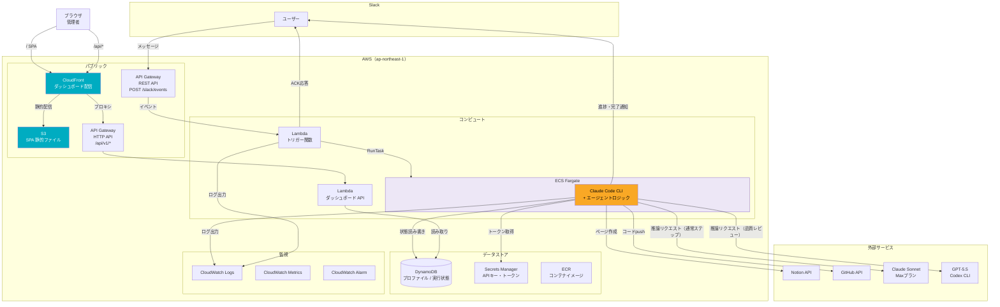

# 技術仕様書

## 1. テクノロジースタック

### 実行基盤

| レイヤー | 技術 | 用途 |
|---------|------|------|
| エージェント実行 | ECS Fargate | Claude Code CLIを実行するコンテナ |
| トリガー | AWS Lambda | Slackイベント受信 → ECSタスク起動 |
| トークンモニター | AWS Lambda + EventBridge Scheduler | Claude OAuth トークン失効の定期監視 |
| APIエンドポイント | Amazon API Gateway（REST API） | Slackイベントの受信・署名検証 |
| 状態管理 | Amazon DynamoDB | ワークフロー実行状態・ユーザープロファイルの永続化 |
| シークレット管理 | AWS Secrets Manager | APIキー・トークンの安全な保管 |
| コンテナレジストリ | Amazon ECR | ECSタスク用Dockerイメージの管理 |

### エージェント基盤

| 項目 | 技術 |
|------|------|
| エージェントフレームワーク | Claude Code CLI |
| LLMモデル | Claude Sonnet 4.6（通常ステップ）/ GPT-5.5 via Codex CLI（品質レビューのみ） |
| LLMプラン | Maxプラン（月額固定） |
| 認証 | MaxプランOAuth（Claude Code公式アプリケーション経由） |
| Web検索 | Claude Code組み込み WebSearch / WebFetch |
| サブエージェント管理 | `claude -p` のサブプロセス呼び出し（ThreadPoolExecutorで並列制御） |

選定の詳細は `obsidian/2026-04-04_agent-runtime-selection-claude-code-cli-on-ecs.md` を参照。

### 外部サービス

| サービス | 用途 | 認証方式 |
|---------|------|---------|
| Slack API | ユーザー入力受付・進捗通知・完了通知 | Bot Token（`xoxb-`） |
| Notion API | 成果物ページの作成・更新 | Integration Token |
| GitHub API | コード成果物のpush | Fine-grained PAT（`contents: write`） |

### 言語・ランタイム

| コンポーネント | 言語 | ランタイム |
|--------------|------|-----------|
| Lambda（トリガー） | Python 3.13 | AWS Lambda |
| ECSタスク（エージェント実行） | Node.js（Claude Code CLI） + Python（ラッパースクリプト） | ECS Fargate |

### フロントエンド（ダッシュボード SPA）

| 項目 | 技術 | 用途 |
|------|------|------|
| ビルドツール | Vite 8 | 開発サーバー・本番ビルド |
| UIフレームワーク | React 19 | コンポーネントベース UI |
| 言語 | TypeScript | 型安全な実装 |
| スタイリング | Tailwind CSS v4 | ダーク専用テーマ（--primary: #6366f1 indigo） |
| UIコンポーネント | shadcn/ui | アクセシブルなプリミティブコンポーネント |
| データフェッチ | TanStack Query v5 | サーバー状態管理・キャッシュ |
| ルーティング | React Router v7 | SPA クライアントルーティング |
| チャート | Recharts | メトリクス可視化 |
| テスト | Vitest + React Testing Library | ユニットテスト（41件） |

## 2. インフラストラクチャ構成

### 全体構成図



### ネットワーク構成

| 項目 | 設定 |
|------|------|
| VPC | 使用する（パブリックサブネットのみ） |
| サブネット | パブリックサブネット × 2 AZ |
| ECS Fargate | パブリックサブネット + パブリックIP割り当て |
| Lambda | VPC外（デフォルト、AWSマネージドネットワーク） |
| 外部API通信 | インターネット経由（HTTPS） |
| セキュリティグループ | インバウンド: 全拒否 / アウトバウンド: HTTPS（443）のみ |

#### パブリックサブネット構成の採用理由

ECSタスクは外部API（Slack, Notion, GitHub, Claude）へのアウトバウンド通信のみ行い、インバウンド通信は不要。LambdaからECSへの起動は`RunTask` API（AWSコントロールプレーン経由）であり、コンテナへの直接通信は発生しない。

プライベートサブネット + NAT Gatewayは月額~$32のコストが追加されるが、セキュリティグループでインバウンドを全拒否し、Fargateタスクがタスク実行中のみ起動する（パブリックIPもタスク終了で消滅する）本構成では、NAT Gatewayによる追加のネットワーク隔離の効果は限定的であり、コストに見合わない。

### リージョン

| 項目 | リージョン | 理由 |
|------|-----------|------|
| 全AWSリソース | ap-northeast-1（東京） | ユーザーの所在地に最も近い |

## 3. コンテナ設計

### Dockerイメージ構成

```dockerfile
FROM node:22-slim

# 非rootユーザー作成
RUN groupadd -r appuser && useradd -r -g appuser -m appuser

# Claude Code CLI と Codex CLIのインストール
RUN npm install -g @anthropic-ai/claude-code @openai/codex@0.125.0 \
    && codex --version

# Python（ラッパースクリプト用）+ curl
RUN apt-get update && apt-get install -y --no-install-recommends python3 python3-pip curl \
    && rm -rf /var/lib/apt/lists/*

# アプリケーションコード
COPY src/agent/ /app/
WORKDIR /app

# Python依存パッケージ
RUN pip3 install --no-cache-dir -r requirements.txt --break-system-packages

# 非rootユーザーで実行
USER appuser

ENTRYPOINT ["python3", "main.py"]
```

### ECSタスク定義

| 項目 | 値 | 備考 |
|------|-----|------|
| CPU | 1 vCPU | Claude Code CLI + サブエージェント並列実行 |
| メモリ | 2 GB | 複数サブエージェントの同時実行に対応 |
| プラットフォーム | Linux/ARM64 | Gravitonでコスト最適化 |
| タスクロール | ECSTaskRole | DynamoDB, Secrets Manager, CloudWatch Logsへのアクセス |
| 実行ロール | ECSTaskExecutionRole | ECRからのイメージ取得 |
| ログドライバー | awslogs | CloudWatch Logsへ出力 |

### 環境変数

#### タスク定義の環境変数（固定値）

| 変数名 | 値のソース | 用途 |
|--------|-----------|------|
| `NOTION_DATABASE_ID` | タスク定義 | 成果物DBのID |
| `GITHUB_REPO` | タスク定義 | コード成果物リポジトリ名 |
| `DYNAMODB_TABLE_PREFIX` | タスク定義 | DynamoDBテーブル名のプレフィックス |

#### ランタイム環境変数（Lambda → ECSタスク起動時に設定）

| 変数名 | 値のソース | 用途 |
|--------|-----------|------|
| `EXECUTION_ID` | Lambda（生成） | ワークフロー実行ID |
| `USER_ID` | Lambda（Slackイベントから取得） | Slack User ID |
| `TOPIC` | Lambda（Slackイベントから取得） | トピックテキスト |
| `SLACK_CHANNEL` | Lambda（Slackイベントから取得） | 通知先チャンネルID |
| `SLACK_THREAD_TS` | Lambda（ACK応答のレスポンスから取得） | ACKメッセージのthread_ts |

#### シークレット（main.pyが起動時にSecrets Managerから取得）

| シークレット | Secrets Manager名 | 用途 |
|------------|-------------------|------|
| Slack Bot Token | `catch-expander/slack-bot-token` | Slack通知の送信 |
| Notion Token | `catch-expander/notion-token` | Notion APIアクセス |
| GitHub Token | `catch-expander/github-token` | GitHub APIアクセス |
| Claude Code OAuth | `catch-expander/claude-oauth` | Claude Code CLI認証（`~/.claude/` に配置） |
| Codex CLI OAuth | `catch-expander/codex-auth` | Codex CLI認証（`~/.codex/auth.json` に配置） |

シークレットはコンテナの環境変数には設定せず、アプリケーション起動時にSecrets Manager APIで取得する。Claude Code / Codex CLI の OAuth 認証情報はファイルとして配置する必要があるため、他のシークレットも同じ方式で統一する。Dockerイメージにクレデンシャルは含めない。詳細は `credential-setup.md` 4.3 / 4.4 を参照。

## 4. Lambda設計

### トリガー関数

```
入力: API Gatewayからのイベント（Slackメッセージ）
処理:
  1. Slackリクエスト署名検証
  2. イベントタイプの判定（app_mention / message.im）
  3. Slackへ即座にACK応答（「受け付けました」メッセージ投稿）
  4. DynamoDBにワークフロー実行レコードを作成（status: received）
  5. ECS RunTask APIでFargateタスクを起動（非同期）
出力: 200 OK（Slackへのレスポンス）
```

| 項目 | 値 |
|------|-----|
| ランタイム | Python 3.13 |
| メモリ | 256 MB |
| タイムアウト | 10秒 |
| 実行ロール | LambdaTriggerRole（ECS RunTask, DynamoDB, Secrets Manager） |

### トークンリフレッシャー関数

```
入力: EventBridge 定期スケジュールイベント
処理:
  1. Secrets Manager から Claude OAuth credentials（JSON）を取得
  2. `claudeAiOauth.expiresAt` を確認し、残り 1 時間以下または失効済みなら refresh をトリガー
  3. Anthropic OAuth エンドポイント（`https://platform.claude.com/v1/oauth/token`）に
     `refresh_token` で POST し、新 access_token / refresh_token / expires_in を取得
  4. 新トークンを Secrets Manager に書き戻し（put_secret_value）
  5. refresh が失敗した場合（HTTP 4xx/5xx、`refreshToken` 不在など）のみ、
     Slack 通知チャンネルへ「再認証が必要」案内を投稿
出力: {"refreshed": bool, "reason"?: str, "new_expires_at_ms"?: int}
```

| 項目 | 値 |
|------|-----|
| ランタイム | Python 3.13 |
| メモリ | 128 MB |
| タイムアウト | 30秒 |
| トリガー | EventBridge Scheduler（既定 12 時間ごと） |
| refresh 判定しきい値 | 残り時間 ≤ 1 時間（`REFRESH_BUFFER_MS = 3600000` で固定） |
| 実行ロール | TokenMonitorRole（Secrets Manager 読み取り＋ `claude-oauth` への書き込み） |
| 主要環境変数 | `CLAUDE_OAUTH_SECRET_ARN` / `SLACK_BOT_TOKEN_SECRET_ARN` / `SLACK_NOTIFICATION_CHANNEL_ID` |

実装は `src/token_monitor/handler.py`。Anthropic OAuth クライアント ID は Claude Code CLI 公開のもの（`9d1c250a-...`）を AS OF 2026-04-25 でハードコード。仕様変更があれば handler.py 冒頭の定数のみ更新する。

ECS Fargate タスクは起動時に Secrets Manager から credentials を取得して `~/.claude/.credentials.json` に展開し、タスク終了時（finally）に内容に変化があれば Secrets Manager に書き戻す（ベストエフォート、`src/agent/main.py:_writeback_claude_credentials`）。これは Claude CLI がタスク実行中に内部 refresh した場合の救済。

**Token Refresher Lambda は Claude OAuth のみが対象。** Codex CLI（GPT-5.5）の access_token は TTL 約 10 日と長く、また Codex CLI がタスク実行中に自動で refresh して `~/.codex/auth.json` を上書きする。そのため Codex は ECS タスク終了時の writeback（`_writeback_codex_credentials`）のみで運用し、Lambda による定期 refresh は不要。

初回 bootstrap 手順は `.steering/20260425-auth-redesign-aipapers/initial-setup.md` を参照（ローカル PC で 1 回認証 → Secrets Manager に投入）。

## 4.5 エージェント出力フォーマットの設計判断

### 統一 JSON 方式とコード成果物の例外

エージェントの各 step は原則として `claude -p --output-format json` で構造化レスポンスを返す統一インターフェース（`call_claude` ヘルパー）を採用している。これは Python 側で複数 step の結果を統合・整形・後続処理（Notion 投稿、GitHub プッシュ）に流すための合理的設計で、トピック解析・ワークフロー設計・リサーチャー要約・レビュアー合否などのテキスト構造化データには十分機能している。

ただし **コード成果物（`iac_code` / `program_code`）のみは例外** として、Claude Code CLI の Write ツール経由でファイルシステムに直接書かせる方式（`call_claude_with_workspace`）を採用している。

### なぜコード成果物だけ例外か（性質的差異）

| 出力 | サイズ | 特殊文字密度 | JSON 適性 |
|------|--------|--------------|-----------|
| トピック解析 | ~500 字 | 低 | ◯ |
| ワークフロー設計 | ~1,000 字 | 低 | ◯ |
| リサーチャー要約 | ~2,000 字 | 中 | ◯ |
| レビュアー合否 | ~1,000 字 | 低 | ◯ |
| **コード成果物** | **10,000+ 字** | **高（HCL/Python 構文の `\"`、`${var}`、`\\n`、ヒアドキュメント等）** | **✗** |

コード成果物だけが「サイズが 1 桁大きい」「JSON エスケープと衝突する特殊文字を密に含む」という二重の質的差異を持つ。LLM に「JSON 文字列値の中に数千〜数万文字のコードを正しくエスケープして詰めさせる」ことは確率的に必ずどこかで失敗する。実際、過去 5 回の修正（`ed148f6` Robust JSON parsing、`d8589e7` レスポンス分割、`d951ecc` タイプ別分離、`5e77dd3` payload 正規化、`f0b121a` 診断ログ）でも parse_error は再発した。

### 採用した方式

`src/agent/orchestrator.py:call_claude_with_workspace` で以下を実施:

1. `tempfile.mkdtemp(prefix="agent-output-<code_type>-")` で sandbox を作成
2. `subprocess.run(["claude", "-p", "--allowedTools", "Write,Edit", ...], cwd=sandbox)` で Claude を起動
3. Claude が Write ツールで sandbox 配下にファイルを書き出す（JSON エスケープ層なし）
4. `_collect_workspace_files` で os.walk + ホワイトリスト + symlink 拒否 + サイズ上限 + UTF-8 検証
5. `_classify_workspace_outcome` で valid / all_empty / no_recognized / none を判定
6. `finally` で `shutil.rmtree(sandbox)` で sandbox を削除

### 設計の例外を明示する理由

ai-papers-digest（参考にした要約パイプライン）はコード成果物を持たないため、全 step を JSON で統一できる。本プロジェクトでも統一性は美徳だが、コード成果物の性質的差異を無視して統一性を優先すると、JSON エスケープ起因の parse_error を構造的に解消できない。「**統一インターフェースが正解とは限らない**」という教訓を本ドキュメントに明記し、将来「統一性のために再び JSON 方式に戻したい」誘惑が起きたとき、過去の失敗が思い出せるようにする。

詳細経緯: `.steering/20260425-code-gen-redesign-filesystem/`

## 5. DynamoDBテーブル設計

### テーブル一覧

| テーブル名 | 用途 | キー設計 |
|-----------|------|---------|
| `{prefix}-user-profiles` | ユーザープロファイル | PK: `user_id` |
| `{prefix}-workflow-executions` | ワークフロー実行状態（任意属性: `total_tokens_used`, `total_input_tokens`, `total_output_tokens`, `total_cost_usd`） | PK: `execution_id` |
| `{prefix}-workflow-steps` | ワークフローステップ | PK: `execution_id`, SK: `step_id` |
| `{prefix}-deliverables` | 成果物メタデータ | PK: `execution_id`, SK: `deliverable_id` |
| `{prefix}-sources` | 出典情報 | PK: `execution_id`, SK: `source_id`（`{step_id}:src-NNN` 形式でシステムワイド一意） |
| `{prefix}-events` | 観測イベントログ（TTL あり） | PK: `execution_id`, SK: `sk` |

### キャパシティ設計

| 項目 | 設定 | 理由 |
|------|------|------|
| キャパシティモード | オンデマンド | 利用量が少なく予測が難しいため |
| TTL | workflow-executions, workflow-steps, sources, events に90日のTTL | 古い実行ログの自動削除 |

### GSI（グローバルセカンダリインデックス）

| テーブル | GSI名 | PK | SK | 用途 |
|---------|-------|-----|-----|------|
| workflow-executions | `user-id-index` | `user_id` | `created_at` | ユーザー別の実行履歴取得 |
| events | `gsi_global_timestamp` | `gsi_pk` | `timestamp` | 全実行横断クエリ |
| events | `gsi_event_type_timestamp` | `event_type` | `timestamp` | イベント種別クエリ |

## 6. API Gateway設計

### Slack トリガー（REST API）

| 項目 | 設定 |
|------|------|
| APIタイプ | REST API |
| エンドポイント | `POST /slack/events` |
| 統合タイプ | Lambda プロキシ統合 |
| 認証 | なし（Slack署名検証はLambda内で実施） |
| スロットリング | 10リクエスト/秒（バースト: 20） |

### ダッシュボード API（HTTP API）

| 項目 | 設定 |
|------|------|
| APIタイプ | HTTP API（`AWS::Serverless::HttpApi`） |
| エンドポイント群 | `/api/v1/auth/*`、`/api/v1/executions`、`/api/v1/executions/{id}`、`/api/v1/executions/{id}/events`、`/api/v1/metrics/*`、`/api/v1/errors` |
| 統合タイプ | Lambda プロキシ統合（エンドポイント別 Lambda 関数） |
| 認証 | JWT cookie（Slack OAuth → Lambda Authorizer 検証） |
| CORS | 不要（CloudFront が `/api/*` を同一オリジン経路でプロキシするため） |
| アクセス経路 | CloudFront 経由のみ（直接アクセスは不可） |

## 7. セキュリティ設計

### 認証・認可

| 対象 | 方式 | 保管場所 |
|------|------|---------|
| Slack Bot Token | OAuth Bot Token（`xoxb-`） | Secrets Manager |
| Slack Signing Secret | HMAC-SHA256署名検証用 | Secrets Manager |
| Notion Integration Token | Internal Integration Token | Secrets Manager |
| GitHub PAT | Fine-grained PAT | Secrets Manager |
| Claude Code認証 | MaxプランOAuth | Secrets Manager → タスク起動時に復元 |
| Codex CLI認証 | ChatGPT OAuth（`auth_mode: chatgpt`） | Secrets Manager → タスク起動時に復元 |

### IAMロール設計

#### LambdaTriggerRole

```json
{
  "Effect": "Allow",
  "Action": [
    "ecs:RunTask",
    "iam:PassRole",
    "dynamodb:PutItem",
    "secretsmanager:GetSecretValue",
    "logs:CreateLogGroup",
    "logs:CreateLogStream",
    "logs:PutLogEvents"
  ],
  "Resource": ["対象リソースARNに限定"]
}
```

#### ECSTaskRole

```json
{
  "Effect": "Allow",
  "Action": [
    "dynamodb:GetItem",
    "dynamodb:PutItem",
    "dynamodb:UpdateItem",
    "dynamodb:BatchWriteItem",
    "dynamodb:Query",
    "secretsmanager:GetSecretValue",
    "logs:CreateLogGroup",
    "logs:CreateLogStream",
    "logs:PutLogEvents"
  ],
  "Resource": ["対象リソースARNに限定"]
}
```

### セキュリティ対策一覧

| 脅威 | 対策 |
|------|------|
| 不正なSlackリクエスト | Slack Signing Secretによる署名検証 |
| シークレットの漏洩 | 全クレデンシャル（Claude Code OAuth含む）をSecrets Managerで管理。Dockerイメージ・環境変数にハードコードしない |
| Notion APIの過剰操作 | アプリケーション層で操作制限（functional-design.md 4.2参照） |
| DynamoDBへの不正アクセス | IAMロールでリソースARNレベルに制限 |
| コンテナの権限昇格 | ECS Fargateのタスクロールで最小権限を付与 |
| 外部APIへの個人情報送信 | Web検索クエリにユーザー個人情報を含めない設計 |

## 8. 監視・ログ設計

### ログ

| コンポーネント | ログ出力先 | 保持期間 |
|--------------|-----------|---------|
| Lambda | CloudWatch Logs `/aws/lambda/{function-name}` | 30日 |
| ECSタスク | CloudWatch Logs `/ecs/{cluster}/{service}` | 30日 |
| API Gateway | CloudWatch Logs `/aws/apigateway/{api-name}` | 30日 |

### メトリクス

| メトリクス | ソース | 用途 |
|-----------|--------|------|
| Lambda呼び出し回数 | CloudWatch Metrics | トリガー頻度の把握 |
| Lambda実行時間 | CloudWatch Metrics | ACK応答の遅延検知 |
| ECSタスク実行時間 | カスタムメトリクス | ワークフロー処理時間の把握 |
| ECSタスク成功/失敗数 | カスタムメトリクス | 提案完了率の計測 |
| DynamoDB消費キャパシティ | CloudWatch Metrics | コスト監視 |

### アラーム

| アラーム | 条件 | 通知先 |
|---------|------|--------|
| Lambda実行エラー | エラー率 > 10%（5分間） | Slack通知 |
| ECSタスク失敗 | 失敗タスク数 > 0（5分間） | Slack通知 |
| Maxプラン利用上限接近 | カスタムメトリクスで検知 | Slack通知 |

## 8.5 タスク失敗時の通知設計

ECS タスク (`src/agent/main.py`) が例外で終了する場合、`_notify_task_failure(slack_token, exc)` が `SLACK_THREAD_TS` のスレッドへ案内文を投稿する。例外型に応じて文言を分岐する。

| 例外型 | Slack 文言の方針 |
|--------|-----------------|
| `NotionCloudflareBlockError`（`src/agent/storage/notion_client.py`） | Notion 前段（Cloudflare）で拒否された旨と、数分〜数十分後の再投入を案内。`execution_id` を併記 |
| その他の `Exception` | 汎用エラー文言。Claude OAuth 期限切れの可能性を案内し、DevContainer で `claude` コマンドの再実行を促す |

通知自体が失敗した場合は warning ログのみ残し、元の例外を再 raise する（隠蔽しない）。`SLACK_CHANNEL` / `SLACK_THREAD_TS` が未設定の場合は通知をスキップする。

Cloudflare ブロック検知時は `notion_client._request_with_retry` が以下を warning ログに記録し、`NotionCloudflareBlockError` を送出する。

- `cf_ray` / `cf_mitigated` / `cf_cache_status` / `Server` ヘッダ
- `user_agent_sent`（送出した User-Agent）
- `body_snippet`（HTML ボディ先頭 200 文字）
- `response_headers`（`Set-Cookie` / `Authorization` を除外した文字列、1000 文字 truncate）

これにより次回再現時に CloudWatch Logs Insights で根本原因（User-Agent / JA3 / IP 評判 / WAF ルール等）の絞り込みが可能になる。

## 9. デプロイ設計

### IaC

| 項目 | 技術 |
|------|------|
| IaCツール | AWS SAM（Serverless Application Model） |
| テンプレート形式 | YAML |
| 対象リソース | Lambda, API Gateway, DynamoDB, IAMロール, CloudWatch |

ECS Fargate（タスク定義、クラスター、サービス）はSAMテンプレート内でCloudFormationリソースとして定義する。

### デプロイフロー

```
ローカル開発
  │
  ├── Dockerイメージビルド → ECRにpush
  │
  └── SAMテンプレート
        │
        ├── sam build
        ├── sam deploy --guided（初回）
        └── sam deploy（2回目以降）

フロントエンド（SPA）
  │
  ├── npm run build（Vite ビルド → frontend/dist/）
  └── aws s3 sync frontend/dist/ s3://catch-expander-frontend-{account}/
        └── CloudFront キャッシュ無効化（/index.html）
```

### CI/CD

| ワークフロー | ファイル | トリガー | 処理 |
|------------|---------|---------|------|
| フロントエンドビルド検証 | `.github/workflows/build-frontend.yml` | Push / PR | `npm ci` → `npm run build`（型チェック・Vitest 41件） |

### 環境

| 環境 | 用途 | 備考 |
|------|------|------|
| dev | 開発・テスト | 単一環境で運用（個人利用のため） |

個人利用のためステージング・本番の分離は行わない。必要に応じて将来追加する。

## 10. コスト設計

### 月間コスト見積もり（月100回実行を想定）

AWS Pricing API（ap-northeast-1）の実データに基づく。無料枠は適用しない。

| サービス | 単価 | 見積もり | 備考 |
|---------|------|---------|------|
| Maxプラン | — | $100 または $200/月 | プラン選択に依存 |
| ECS Fargate（ARM） | vCPU: $0.04045/h, メモリ: $0.00442/GB-h | $2.47 | 1vCPU/2GB × 0.5h × 100回 |
| Lambda | $0.20/100万リクエスト, $0.0000133334/GB秒（ARM） | $0.002 | 256MB × 5秒 × 100回 |
| API Gateway | $4.25/100万リクエスト（REST API） | $0.0004 | 100回/月 |
| DynamoDB | 書込: $0.715/100万WRU, 読取: $0.1425/100万RRU, 保存: $0.285/GB-月 | $0.29 | オンデマンド、1GB未満 |
| Secrets Manager | $0.40/シークレット/月 | $2.40 | 6シークレット |
| CloudWatch Logs | 取込: $0.76/GB, 保存: $0.033/GB-月 | $0.79 | 月間約1GB |
| ECR | $0.10/GB-月 | $0.05 | イメージ約500MB |
| パブリックIPv4 | $0.005/時間 | $0.25 | タスク実行中のみ（50h） |
| **合計（Maxプラン除く）** | | **$5.85/月** | |

Maxプランの費用（96〜97%）が支配的であり、AWSインフラコストは無視できるレベル。

## 11. 技術的制約

| 制約 | 影響 | 対策 |
|------|------|------|
| Maxプランの利用上限 | 高負荷時にレート制限にかかる可能性 | 月間利用量をモニタリング、上限接近時にSlack通知 |
| Claude Code CLIのコールドスタート | ECSタスク起動に30秒〜1分 | Lambda層で即座にACK応答、ECSは非同期実行 |
| Notion API制限（3リクエスト/秒） | 大量のブロック作成時にスロットリング | 成果物をまとめて構成してから一括投稿 |
| ECS Fargateの同時実行数 | デフォルトクォータに依存 | 個人利用では問題にならない（同時1〜2タスク） |
| Anthropicポリシー変更リスク | Claude Code CLIの自動実行が制限される可能性 | API従量課金へのフォールバック設計（環境変数切り替え） |

## 12. パフォーマンス要件

| 指標 | 目標値 | 実現方法 |
|------|--------|---------|
| ACK応答時間 | 3秒以内 | Lambda層で即座にSlackへ応答 |
| ワークフロー完了時間 | 5分以内（目標3分） | リサーチャーエージェントの並列実行 |
| Web検索1ステップ | 10秒以内 | Claude Code組み込みWebSearch |
