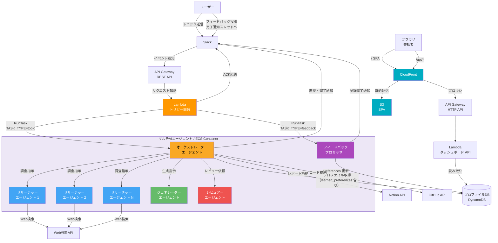
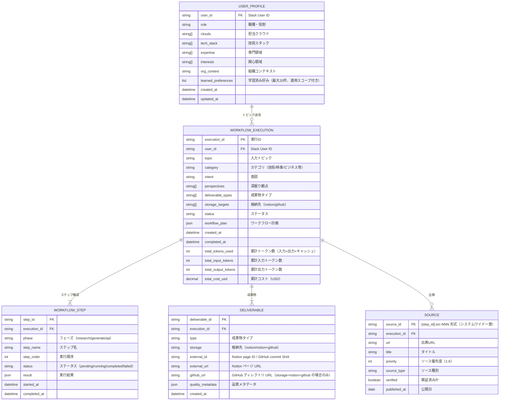
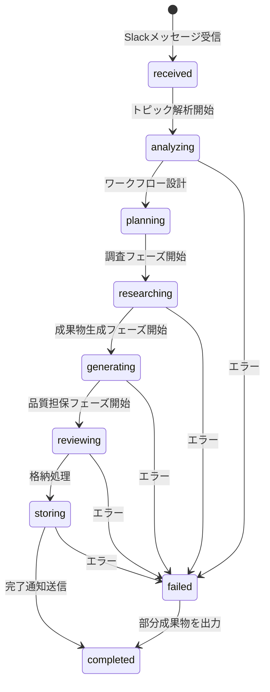
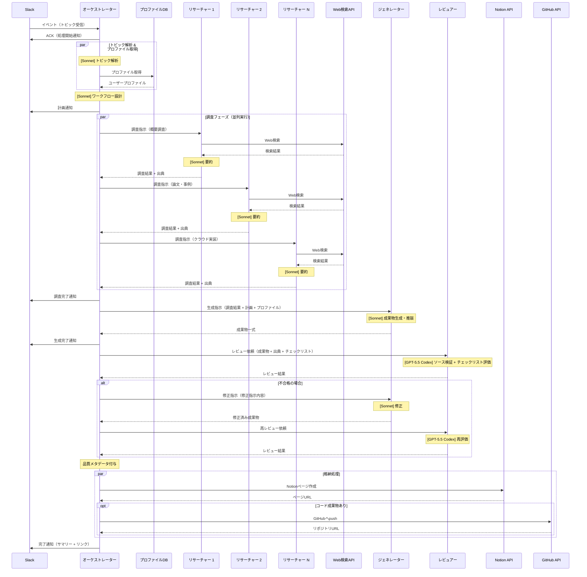
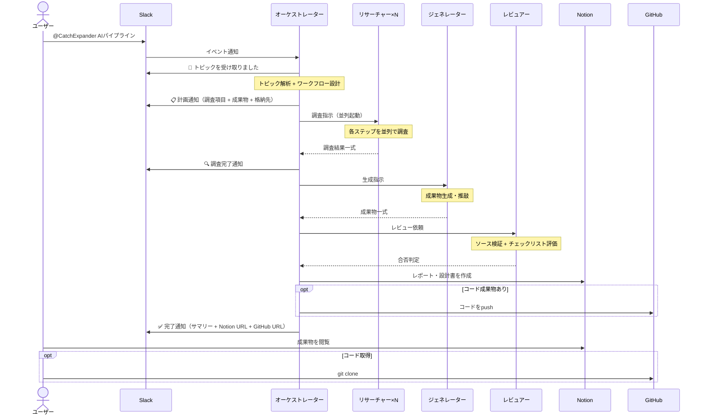
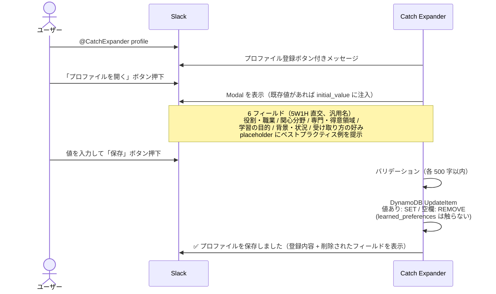
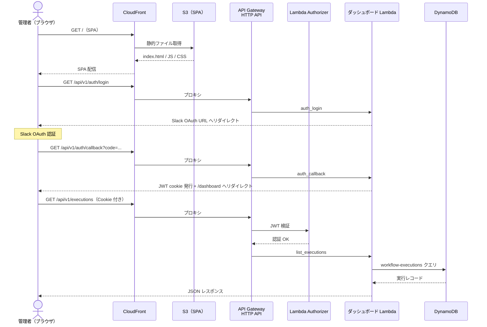

# 機能設計書

## 1. システム全体構成

### システム構成図



### マルチAIエージェント構成

本システムは**マルチAIエージェント構成**を採用する。Claude Code CLI（Maxプラン）をエージェント実行基盤とし、`claude -p` のサブプロセス呼び出し（ThreadPoolExecutorで並列制御）で4種類の専門エージェントが協調して動作する。

選定の詳細は `obsidian/2026-04-04_agent-runtime-selection-claude-code-cli-on-ecs.md` を参照。

```
マルチAIエージェント（ECS Container）
┌─────────────────────────────────────────────────────────┐
│  Claude Code CLI + Claude Sonnet（Maxプラン）            │
│  Codex CLI + GPT-5.5（品質レビューのみ）                  │
│                                                         │
│  ┌───────────────────────────────────────────────┐      │
│  │ オーケストレーターエージェント（司令塔）        │      │
│  │   - トピック解析・ワークフロー設計              │      │
│  │   - サブエージェントへの指示・結果統合          │      │
│  │   - 進捗通知・格納処理の制御                   │      │
│  └──────────┬────────────┬────────────┬──────────┘      │
│             │            │            │                  │
│  ┌──────────▼──────┐ ┌──▼─────────┐ ┌▼───────────────┐ │
│  │ リサーチャー     │ │ ジェネレー │ │ レビュアー     │ │
│  │ エージェント     │ │ ター       │ │ エージェント   │ │
│  │ ×N（並列実行）  │ │ エージェント│ │                │ │
│  │                 │ │            │ │ 独立した視点で │ │
│  │ 調査ステップ    │ │ 成果物生成 │ │ 品質検証       │ │
│  │ ごとに1つ起動  │ │ ・推敲     │ │                │ │
│  └─────────────────┘ └────────────┘ └────────────────┘ │
└─────────────────────────────────────────────────────────┘
```

#### エージェント一覧

| エージェント | 役割 | 専門プロンプト | モデル | 並列性 |
|------------|------|--------------|:---:|:---:|
| オーケストレーター | トピック解析、ワークフロー設計、全体制御、格納処理 | 計画立案・判断に特化 | Sonnet | - |
| リサーチャー | Web検索による情報収集・要約・出典記録 | 調査・要約に特化 | Sonnet | 並列（ステップ数分） |
| ジェネレーター | レポート・コード・設計書の生成・推敲 | 文書/コード生成に特化 | Sonnet | 直列 |
| レビュアー | ソース検証・チェックリスト評価・品質メタデータ付与 | 品質検証・ファクトチェックに特化 | **GPT-5.5 (Codex CLI)** | 直列 |

#### マルチエージェントの利点

- **調査の並列実行** — リサーチャーエージェントを調査ステップ数分同時に起動し、処理時間を短縮
- **レビューの独立性** — レビュアーエージェントは生成エージェントとは別のコンテキストで動作するため、生成時のバイアスを排除
- **専門性の向上** — 各エージェントが専門のシステムプロンプトを持ち、役割に特化した判断ができる

### コンポーネント一覧

| コンポーネント | 役割 | 実行環境 |
|--------------|------|---------|
| Slack Bot App | ユーザーとのインターフェース（入力受付・通知） | Slack |
| API Gateway | Slackイベントの受信・ルーティング | API Gateway |
| トリガー関数 | Slack署名検証、ACK応答、ECSタスク起動、フィードバック検出 | Lambda |
| トークンリフレッシャー関数 | Claude OAuth トークンの自動延命（refresh_token で OAuth エンドポイントを直接叩いて Secrets Manager 上書き）。延命失敗時のみ Slack 通知 | Lambda（EventBridge 定期トリガー） |
| オーケストレーターエージェント | トピック解析、ワークフロー設計、全体制御（learned_preferences 反映） | ECS Container（Claude Code CLI） |
| リサーチャーエージェント（×N） | Web検索による情報収集・要約 | ECS Container（Claude Code Agentツール） |
| ジェネレーターエージェント | 成果物の生成・推敲 | ECS Container（Claude Code Agentツール） |
| レビュアーエージェント | ソース検証・セルフレビュー・品質メタデータ付与 | ECS Container（Claude Code Agentツール） |
| フィードバックプロセッサー | フィードバック解析・preferences 抽出・プロファイル更新（TASK_TYPE=feedback） | ECS Container（Claude Code CLI） |
| プロファイルDB | ユーザープロファイルの永続化（learned_preferences 含む） | DynamoDB |
| Claude Sonnet 4.6 | 全エージェントの推論エンジン（通常ステップ） | Maxプラン（Claude Code CLI経由） |
| GPT-5.5（Codex CLI） | レビュアーエージェントの推論エンジン（品質レビューのみ） | ChatGPT OAuth（Codex CLI経由） |
| Web検索 | インターネット情報の検索 | Claude Code組み込み（WebSearch/WebFetch） |
| Notion API | 成果物ページの作成・更新 | 外部API |
| GitHub API | コード成果物のpush | 外部API |

## 2. データモデル

### ER図



### ステータス遷移



## 3. コンポーネント設計

### 3.1 オーケストレーターエージェント

全体の司令塔。トピック解析・ワークフロー設計を自ら行い、サブエージェントに指示を出し、結果を統合する。



#### 状態管理

オーケストレーターはワークフロー実行の状態をDynamoDBに永続化する。コンテナの異常終了時に再開可能にするため。

```
WORKFLOW_EXECUTION レコード:
{
  "execution_id": "exec-20260404-001",
  "user_id": "U12345",
  "topic": "AIパイプライン",
  "status": "researching",
  "workflow_plan": {
    "research_steps": [...],
    "generate_steps": [...],
    "qa_steps": [...]
  },
  "current_step": 3,
  "slack_channel": "D12345",
  "slack_thread_ts": "1712234567.000100"
}
```

#### エージェント間通信

オーケストレーター（Pythonプロセス）は `claude -p <プロンプト> --output-format json` を `subprocess.run` で呼び出す。リサーチャーは `ThreadPoolExecutor` で並列起動し、ジェネレーター・レビュアーは直列で順次呼び出す。各呼び出しは独立したClaude Codeセッションとなり、専門プロンプトをプロンプトの先頭に埋め込むことで専門コンテキストを実現する。

```
orchestrator.py（Pythonプロセス）
  │
  ├── subprocess call_claude(リサーチャープロンプト + "概要調査指示")   ─┐
  ├── subprocess call_claude(リサーチャープロンプト + "論文・事例調査") ─┤ 並列
  ├── subprocess call_claude(リサーチャープロンプト + "クラウド実装調査")─┘
  │          （ThreadPoolExecutorで並列実行）
  │
  ├── 全リサーチャーの結果を統合
  │
  ├── subprocess call_claude(ジェネレータープロンプト + 調査結果 + 計画)
  │          ↓ コード成果物が必要かつ github 格納対象の場合
  ├── for code_type in (iac_code, program_code):
  │      call_claude_with_workspace(コード生成プロンプト, code_type)
  │      → Claude が Write ツールで sandbox にファイル書き出し
  │      → os.walk で収集 + ホワイトリスト + 安全性チェック
  │
  ├── call_codex(レビュアープロンプト + 成果物)  ← GPT-5.5（Codex CLI）
  │
  └── (不合格なら修正→再レビュー、最大2回)
```

### 3.2 リサーチャーエージェント

調査専門のサブエージェント。調査ステップごとに1つ起動され、**並列で同時実行**される。

#### 専門プロンプト
- 調査・要約に特化したシステムプロンプト
- ソース優先順位ルールを含む
- 出典URLの記録を必須とする指示
- 呼び出し元から与えられた `step_id` を出力 JSON にそのまま設定する指示
- 出典の `source_id` は `src-001, src-002, ...` の形式でゼロから付番（他リサーチャーとの重複はオーケストレーター側で名前空間化して解消）

#### 処理フロー

```
入力: オーケストレーターからの調査指示
  （ステップ定義、ステップID、検索ヒント、カテゴリ、ソース優先順位）
  ↓
1. [Sonnet] 検索クエリを生成（ステップ定義→検索キーワード）
  ↓
2. Claude Code組み込みのWebSearch/WebFetchで検索実行
  ↓
3. [Sonnet] 検索結果からソース優先順位に基づき関連ページを選択
  ↓
4. [Sonnet] ページ内容を取得・要約
  ↓
5. 出典情報（URL、タイトル、公開日、ソース種別）を記録
  ↓
出力: オーケストレーターへ返却
  （要約テキスト + 出典リスト。source_id は後段で
   {step_id}:src-NNN 形式にリマップされる）
```

#### 並列実行

```
例: 5つの調査ステップ

  シングルエージェント（直列）:
    概要 → 論文 → ユースケース → クラウド実装 → コスト = 5ステップ分の時間

  マルチエージェント（並列）:
    概要 ─────┐
    論文 ─────┤
    ユースケース ┤ → 全完了 = 最も遅いステップ1つ分の時間
    クラウド実装 ┤
    コスト ────┘
```

### 3.3 ジェネレーターエージェント

成果物生成専門のサブエージェント。全調査結果を受け取り、**テキスト成果物のみ** を生成・推敲する。コード成果物はオーケストレーターが成果物タイプごとに独立したプロンプトで別途生成する（3.3b 参照）。

#### 専門プロンプト
- 文書生成に特化したシステムプロンプト
- テキスト成果物（Notionブロック形式）の構造化ルールを含む
- ユーザープロファイルに基づくカスタマイズ指示
- 出力は `content_blocks` + `summary` + `quality_metadata` の dict
- **2026-05-13 改修**: 出力方式を **Write ツール経由のファイル書き込み** (`deliverable.json`) に変更。`code_files` は出力しない旨を明示

#### 処理フロー (2026-05-13 改修: workspace モード)

```
入力: オーケストレーターからの生成指示
  （調査結果一式 + ワークフロー計画 + ユーザープロファイル）
  ↓
1. [Sonnet] sandbox 作成 (tempfile.mkdtemp)
  ↓
2. [Sonnet] Write ツール経由で `deliverable.json` に書き込み
   - 調査結果を Notion ブロック形式で整理
   - ユーザープロファイルに基づくカスタマイズ
   - 推敲（全体の整合性確認、表現の改善、出典URLの挿入）
   - 単一の JSON dict として `{content_blocks, summary, quality_metadata}` を書く
  ↓
3. [Python] stat() で size 検査 → read → 検証層 (5 種の検出)
   - file_missing / file_too_large / invalid_json / not_dict /
   - missing_keys / invalid_content_blocks / invalid_summary / invalid_quality_metadata
  ↓
4. [Python] 失敗時は最大 2 回まで自動リトライ (exp backoff 2/4 秒)
  ↓
5. [Python] finally: sandbox cleanup
  ↓
出力: オーケストレーターへ返却 (検証 pass 済みの valid dict)
```

#### Z-2 (workspace モード化) 採用の背景

**2026-05-12 観測のインシデント**: 大規模トピック（5 つの概念をまとめて扱う等）で Claude Sonnet 4.6 が ~30,000 文字超の応答が必要な場合、独自に「Part 1 / Part 2 分割応答」戦略を発火することが実証された (同日トピック 3 回試行で 2 回失敗、`exec-20260512100453-f253b974` 等)。stdout に JSON コードブロックを含む自然文プロローグ + トップレベル `[...]` array を返し、`_parse_claude_response` の戦略 1 が list を返す → `deliverables.pop("code_files", None)` で `TypeError: pop expected at most 1 argument, got 2` で破壊的失敗。

**境界設計変更による解決**: 「LLM の text 応答をアプリでパースする」境界をやめて、LLM に **Write ツール経由で deliverable.json を書かせる** ことで stdout 巨大 JSON 制約を物理的に消去。Part 分割応答を選ぶ動機が消える。code generation (3.3b) で既に採用されていた workspace モードを text generator にも適用する形。

**「努力目標 + 検証層 + 自動リトライ」の三身一体**:
- 努力目標: プロンプトで `deliverable.json` への書き出しを指示 (LLM 確率挙動依存)
- 検証層: post-hoc に 8 種の失敗パターンを確定的に検出
- 自動リトライ: 最大 2 回 (合計 3 試行) で確率的成功率を底上げ
- 全試行失敗時は `NonDictGeneratorResponse` raise + `subagent_failed` emit + Slack 失敗通知

詳細: `.steering/20260512-parse-claude-response-dict-contract/`

#### feature flag

環境変数 `WORKSPACE_TEXT_GEN` で切替可能 (デフォルト `"true"`):
- `"true"`: workspace モード (Z-2 経路、`call_claude_with_text_workspace`)
- `"false"`: 旧 stdout JSON 経路 (`call_claude` + `_parse_claude_response`、即時切り戻し用)

#### 成果物タイプ別の生成仕様

**テキスト成果物（ジェネレーター本体が生成）**
- Notion APIのブロック形式で生成（heading, paragraph, bulleted_list, table, code等）
- Mermaid図は`/mermaid`ブロックとして生成

**コード成果物（3.3b 参照）**
- オーケストレーターが `iac_code` / `program_code` ごとに独立した Claude 呼び出しで生成
- 各呼び出しの `files` をマージし、README は成果物タイプ別のセクションに分けて結合

### 3.3b コード成果物の独立生成（ファイル書き込み方式）

ワークフロー計画の `deliverable_types` に `iac_code` / `program_code` が含まれ、かつ `storage_targets` に `github` が含まれる場合、オーケストレーターは成果物タイプごとに `call_claude_with_workspace(prompt, code_type)` を呼び出してコード成果物を生成する。

**背景**: 旧方式では Claude CLI に「`{"files": {"waf.tf": "<HCL コード>"}}` の形で JSON を返せ」と指示し、Python 側で JSON パースしていた。しかし HCL/Python コードは `\"`、`${var}`、`\\n`、ヒアドキュメント等の JSON エスケープ衝突文字を密に含むため、出力が長くなるほど LLM が確率的にエスケープを誤り parse_error を頻発させた。過去 5 回の修正（パーサー頑健化、レスポンス分割、payload 正規化等）でも根本解決に至らず、2026-04-25 に **JSON エスケープ層を取り除く方針** へ移行した。詳細: `.steering/20260425-code-gen-redesign-filesystem/`

**処理**（ファイル書き込み方式）:
```
for code_type in (iac_code, program_code):
  1. tempfile.mkdtemp で sandbox を作成（/tmp/agent-output-<code_type>-<random>/）
  2. [Sonnet] subprocess.run(["claude", "-p", "--allowedTools", "Write,Edit", ...], cwd=sandbox)
     → Claude が Write ツールで sandbox 配下にファイルを書く
  3. _collect_workspace_files(sandbox) で os.walk + ホワイトリスト + 安全性チェック
     - symlink は早期拒否（is_symlink）
     - sandbox 外への解決パスは破棄（resolve + relative_to）
     - 拡張子ホワイトリスト、サイズ上限 100KB、UTF-8 デコード可能性
  4. _classify_workspace_outcome で valid / all_empty / no_recognized / none を判定
  5. valid: README.md を分離して readme_parts に、その他を files_merged に統合
     失敗: warning ログ + Slack スレッドへ「コード生成失敗」通知
  6. finally: shutil.rmtree(sandbox) で sandbox 削除
finally:
  files_merged が非空なら deliverables["code_files"] にセット
  failed_code_types が非空なら Slack に部分失敗通知
```

**コード成果物ルール**（各プロンプト内で適用）
- Claude Code CLI の Write ツールで相対パスにファイルを書き出す（絶対パス禁止）
- 各ファイルにコメントで説明を付与（PoC 品質明示）
- README.md を 1 ファイル含めてよい（リポジトリ紹介用）
- ファイル数は最大 5 / タイプに抑制
- 1 ファイルあたり 100KB 以下

**性質的差異の根拠**: トピック解析・ワークフロー設計・リサーチャー要約・レビュアー合否は **数百〜数千文字の構造化データ**で JSON 適性が高い。一方コード成果物 (3.3b) は **10,000+ 文字 + 特殊文字密集**で JSON 適性が低く、テキスト成果物 (3.3) も大規模トピックで **30,000+ 文字応答 + LLM の Part 分割応答リスク**が観測された (2026-05-12)。前者は当初からファイル書き込み方式、後者は本日 (2026-05-13) workspace モードに移行。残る 4 経路 (analysis / workflow / researcher / reviewer / fixer) は応答サイズが小さく Part 分割発火条件に達しないため、現状の stdout JSON 経路を維持する (派生 4 として将来検討)。

### 3.4 レビュアーエージェント

品質検証専門のサブエージェント。ジェネレーターとは**独立したコンテキスト**で動作し、生成時のバイアスを排除する。

#### 専門プロンプト
- 品質検証・ファクトチェックに特化したシステムプロンプト
- カテゴリ別チェックリストを含む
- 批判的・客観的な視点での評価を指示

#### 処理フロー

```
入力: オーケストレーターからのレビュー依頼
  （成果物一式 + 出典リスト + カテゴリ別チェックリスト）
  ↓
[第1層: ソース検証]
1. 出典URLにHTTPリクエストを送信し、実在を確認
2. [GPT-5.5 Codex] 取得したページ内容と成果物の記述を照合
3. 未検証の事実主張を検出しマーク付与
  ↓
[第2層: チェックリスト評価]
4. [GPT-5.5 Codex] カテゴリ別チェックリストで各項目を評価
5. 不合格項目に対して具体的な修正指示を生成
  ↓
[第3層: 品質メタデータ生成]
6. 検証ステータス、情報鮮度、レビュー結果を集約
7. 品質メタデータを構成
  ↓
出力: オーケストレーターへ返却
  （合否判定 + 修正指示 + 品質メタデータ）
  ※ レビュアーのみ GPT-5.5（Codex CLI）を使用（Claude とは異なる独立した基盤モデルで品質検証するため）
```

#### レビューループ

```
ジェネレーター → 成果物 → レビュアー → 不合格
                   ↑                      │
                   └── 修正指示 ←─────────┘
                        （最大2回、実装しながら調整）
```

レビュアーとジェネレーターは別のコンテキストで動作するため、ジェネレーターが「自分の出力は正しい」と思い込むバイアスを排除できる。

**修正成果物の永続化**: `_run_review_loop` は `(review_result, final_deliverables)` のタプルを返し、ループ内で適用された修正結果を Notion / GitHub 出力パスに確実に引き継ぐ。修正応答が JSON パースできなかった場合は直前の成果物を保持し、warning ログを出力する（M2）。

**独立生成フィールドの保護**: ジェネレーターの修正プロンプトは契約上テキスト成果物（`content_blocks` / `summary`）のみを返すため、修正レスポンスを `current_deliverables` に単純代入すると 3.3b で生成された `code_files` が失われる。`_run_review_loop` は修正適用時に `_PRESERVED_DELIVERABLE_FIELDS`（現状 `code_files`）を明示的に引き継ぎ、レビューループを跨いでも独立生成パイプラインの成果物が保持されることを保証する。

**修正可能範囲のスコープ宣言**: `_run_review_loop` の修正再生成プロンプト (`fix_prompt`) には「本ループで修正できるのは text 成果物 (`content_blocks` / `summary`) のみ。`code_files` は別パイプラインで独立生成されており本ループでは修正できない」とのスコープ制約を明示する。これにより、レビュアーが出すコード関連指摘（構文・API バージョン・README 整合性等）を受け取った場合に、ジェネレーターが summary に「コードを修正した」と主張する（実体は変わらない）乖離を緩和する。コード関連指摘は `quality_metadata.notes` に「本ループ未修正」として記録され、Notion 出力で利用者が認識できる状態を保つ。

**Fixer notes の出力経路保護**: 修正再生成でジェネレーターが `quality_metadata.notes` に「コード関連指摘 N 件は本ループ未修正」と記録しても、後続のレビュアーが `passed: True` を返した場合、最終的に Notion / DynamoDB に出力されるのはレビュアーの `quality_metadata` であり、ジェネレーター側の note は捨てられる経路がある。さらに修正再生成は最大 2 回まで実行され、2 回目で `current_deliverables` が新応答に置換されると 1 回目の fixer notes も失われる。`_run_review_loop` は (1) 各 fix attempt 直後に `_accumulate_fixer_notes` で notes を accumulator に退避し、(2) 各 return 直前に `_apply_accumulated_fixer_notes` で `review_result.quality_metadata.notes` へ重複なくマージする。これにより全周回の fixer notes が決定論的に最終出力へ届くことを保証する。

**fix loop での content_blocks 構造的保護**: fix loop の deliverables 置換時、fixer LLM 応答が `content_blocks` を omit / null / 空 list / 非 list で返した場合、直前の non-empty list を自動で引き継ぐ条件付き fallback を実装している。`_classify_content_blocks_fallback_reason` で 4 つの無効値パターンを判定し、旧版が valid な non-empty list のときだけ fallback を適用する。fixer が valid な non-empty list を返した場合は通常通り fixer の修正版が採用される。本保護は plain Python の決定論的処理で、プロンプト指示への依存はない。発動時は `logger.warning` で `loop` / `reason` / `previous_blocks_count` を記録し、`logger.info` の `Deliverables updated by review fix` 側にも `content_blocks_fallback_reason` (判定結果) と `content_blocks_fallback_applied` (実適用) の両方を記録することで、CloudWatch Logs Insights で「fallback 発動」「旧版も無効で諦め」「正常完了」の 3 系統を分けて集計可能にする。`parsed` が dict でない（JSON array/scalar）経路は `isinstance(parsed, dict)` ガードで `parsed.get(...)` の AttributeError を防止し、warning を出した上で旧版を保持する。2026-05-09 の Notion 本文消失インシデントを契機にプロンプト変更耐性を高めるための構造変更（パイプライン層）。

## 4. 外部連携設計

### 4.1 Slack連携

#### イベント処理

| イベント | トリガー | 処理 |
|---------|---------|------|
| `app_mention` | チャンネルでメンション | トピック受信→ワークフロー開始 |
| `message.im` | Bot宛てDM | トピック受信→ワークフロー開始 |

#### Slack Bot コマンド

| コマンド | 機能 |
|---------|------|
| `@CatchExpander <トピック>` | トピック送信 |
| `@CatchExpander profile` | プロファイル登録・更新（Slack Modal 経由、5W1H 6 軸 — 実装済み、5.2 参照） |
| `@CatchExpander status` | 実行中のワークフロー状況確認 — **未実装**（設計のみ） |
| `履歴` / `history [keyword]` | 過去成果物の履歴取得（F9）— 実装済み |

#### メッセージ構成

進捗通知と完了通知はSlackのスレッド内に投稿する。

```
[メインメッセージ] 📨 トピックを受け取りました。
  └── [スレッド] 📋 計画通知
  └── [スレッド] 🔍 進捗通知 × N
  └── [スレッド] ✅ 完了通知（サマリー + リンク）
```

### 4.2 Notion連携

#### 成果物DB構造

```
Database: Catch Expander 成果物
Properties:
  - タイトル (title): トピック名
  - カテゴリ (select): 技術 / 時事 / ビジネス / 学術 / カルチャー
  - 日付 (date): 作成日
  - ステータス (select): 作成中 / 完了
  - GitHub URL (url): コード成果物のリポジトリURL（該当時のみ）
  - Slack User (rich_text): リクエスト元ユーザー
```

#### ページ構成

成果物ページのセクション構成はエージェントが自律的に決定するが、以下の共通構造を持つ。

```
[ページタイトル] トピック名

[共通セクション]
├── 各成果物セクション（エージェントが決定）
│   ├── 調査レポート
│   ├── 設計書（該当時）
│   ├── 比較表（該当時）
│   ├── コード成果物へのリンク（該当時）
│   └── ...
├── まとめと推奨アクション
├── 出典一覧（全出典URLをリスト）
└── 品質情報（品質メタデータ）
```

#### Notion API操作の安全設計

| 操作 | API | 許可 |
|------|-----|:---:|
| ページ作成 | POST /pages | o |
| 自身作成ページの更新 | PATCH /pages/{id}, PATCH /blocks/{id} | o（execution_id照合） |
| 完了済みページの更新 | PATCH /pages/{id} | x（ステータスチェック） |
| ページ削除 | DELETE /blocks/{id} | x（呼び出さない） |
| DB構造の変更 | PATCH /databases/{id} | x（呼び出さない） |

#### 実装上の制約・仕様

- **100ブロック上限**: Notion APIの `append_block_children` は1リクエストあたり100ブロックが上限。`create_page()` は `content_blocks` を100ブロック単位に分割してチャンク投稿する。
- **`rich_text` 2000文字上限**: Notion API は単一の `rich_text` 要素が 2000 文字を超えると 400 エラーを返す。`create_page()` 投入前に各 `rich_text` を 2000 文字以内に分割し、同一ブロック内の複数 `text` 要素として送信する。
- **Cloudflare ブロック検知**: `_request_with_retry` は 403 レスポンスのボディに Cloudflare 特有のシグネチャを検出した場合、リトライせず `NotionCloudflareBlockError` を送出する。`cf_ray` / `cf_mitigated` / `user_agent_sent` 等を warning ログの `extra` に記録する（詳細は `architecture.md` 8.5 参照）。
- **`create_page()` 戻り値**: `tuple[str, str]`（`page_url, page_id`）を返す。`page_id` はステータス更新（`update_page_status()`）に使用する。
- **出典の `source_id` は呼び出し元で一意化済み**: オーケストレーターが `{step_id}:src-NNN` 形式に名前空間化して `put_sources()` に渡す（M1）。`put_sources()` は UUID 付与は行わず、同じ `source_id` / URL のエントリはスキップしてから DynamoDB `batch_writer()` で一括登録する。

### 4.3 GitHub連携

#### リポジトリ構成

```
catch-expander-code/              # コード成果物専用リポジトリ（Private）
├── ai-pipeline-20260404/
│   ├── README.md
│   ├── aws/
│   │   ├── main.tf
│   │   ├── variables.tf
│   │   └── outputs.tf
│   └── gcp/
│       ├── main.tf
│       ├── variables.tf
│       └── outputs.tf
├── ecs-autoscaling-20260410/
│   ├── README.md
│   └── ...
└── ...
```

#### GitHub API操作

| 操作 | API | 用途 |
|------|-----|------|
| ファイル作成・更新 | PUT /repos/{owner}/{repo}/contents/{path} | コード成果物のpush |
| README作成 | PUT /repos/{owner}/{repo}/contents/{path}/README.md | 概要 + Notionリンク |

- Fine-grained PATで `contents: write` 権限のみ付与
- ブランチ: `main` に直接push（成果物リポジトリのためPR不要）

### 4.4 エージェントモデル連携

#### モデルとプラン

| 項目 | 内容 |
|------|------|
| 通常ステップモデル | Claude Sonnet 4.6 |
| 品質レビューモデル | GPT-5.5（Codex CLI経由） |
| Claudeプラン | Maxプラン（月額固定） |
| Claude アクセス方式 | Claude Code CLI（Anthropic公式アプリケーション） |
| Claude 認証 | MaxプランOAuth（Claude Codeの想定された利用方法） |
| Codex アクセス方式 | Codex CLI（OpenAI公式CLIツール） |
| Codex 認証 | ChatGPT OAuth（`auth_mode: chatgpt`、`~/.codex/auth.json`） |
| 選定理由 | レビュアーは Claude とは異なる独立した基盤モデルで検証することで生成時バイアスを排除。通常ステップは Claude Sonnet で速度とコストを最適化。 |

#### Claude Code CLIの実行方法（通常ステップ）

```bash
# 通常ステップ（Sonnet）
claude -p "プロンプト" --model sonnet --output-format json

# ツール制限（必要に応じて）
claude -p "プロンプト" --model sonnet --allowedTools "WebSearch,WebFetch,Read,Write,Bash"
```

#### Codex CLIの実行方法（品質レビュー）

```bash
# 品質レビュー（GPT-5.5）
codex exec --model gpt-5.5 "プロンプト"
```

#### 呼び出し一覧（エージェント別）

| エージェント | # | 呼び出し | モデル | 入力 | 出力 |
|------------|---|---------|:---:|------|------|
| オーケストレーター | 1 | トピック解析 | Sonnet | トピックテキスト | JSON（カテゴリ、意図、観点リスト） |
| オーケストレーター | 2 | ワークフロー設計 | Sonnet | 解析結果 + プロファイル | JSON（ステップリスト、成果物タイプ） |
| リサーチャー（×N） | 3 | 調査要約 | Sonnet | 検索結果テキスト | 要約テキスト + 出典リスト |
| ジェネレーター | 4 | テキスト成果物生成（下書き→推敲） | Sonnet | 調査結果 + 計画 + プロファイル | `content_blocks` + `summary` |
| ジェネレーター | 4b | コード成果物独立生成（成果物タイプごと） | Sonnet | 調査結果 + `code_type`（iac_code / program_code 各1回） | sandbox cwd へ Write ツール経由でファイル直接書き出し（Python 側で os.walk 収集 → `code_files = {"files": {...}, "readme_content": "..."}` を構築） |
| レビュアー | 5 | ソース検証 + チェックリスト評価 | **GPT-5.5 (Codex)** | 成果物 + 出典 + チェックリスト | JSON（合否判定、修正指示） |
| ジェネレーター | 6 | 修正（0〜2回） | Sonnet | 成果物 + 修正指示 | 修正済み成果物 |
| レビュアー | 7 | 再レビュー（0〜2回） | **GPT-5.5 (Codex)** | 修正済み成果物 + チェックリスト | JSON（合否判定） |

#### 1回のトピック処理あたりの呼び出し数

```
最小（時事トピック・コードなし・レビュー合格）:
  オーケストレーター: 2（解析 + WF設計）      Sonnet
  リサーチャー×N:    N（並列実行だが呼び出し数は同じ） Sonnet
  ジェネレーター:    1（生成）                 Sonnet
  レビュアー:       1（レビュー）              GPT-5.5 (Codex)
  合計: N + 4

標準（技術トピック・コード生成あり: iac_code のみ・レビュー合格）:
  上記 + コード独立生成 1回（Sonnet）
  合計: N + 5

標準（技術トピック・コード生成あり: iac_code + program_code・レビュー合格）:
  上記 + コード独立生成 2回（Sonnet, タイプごと）
  合計: N + 6

最大（技術トピック・iac_code + program_code・修正2回）:
  オーケストレーター: 2                        Sonnet
  リサーチャー×N:    N                         Sonnet
  ジェネレーター:    1 + 2 + 2（生成 + コード×2タイプ + 修正2回） Sonnet
  レビュアー:       1 + 2（レビュー + 再レビュー2回）    GPT-5.5 (Codex)
  合計: N + 10
  ※ N = 調査ステップ数（通常3〜5）
```

#### 並列実行による時間短縮

```
直列実行（シングルエージェント）:
  解析 → WF設計 → 調査1 → 調査2 → ... → 調査N → 生成 → レビュー
  所要時間: 全ステップの合計

並列実行（マルチエージェント）:
  解析 → WF設計 → [調査1〜N 並列] → 生成 → レビュー
  所要時間: 調査フェーズが最長1ステップ分に短縮
```

すべてClaude Code CLIプロセス内で実行され、Maxプランの利用枠内で処理される。

## 5. 画面遷移・ユーザーインタラクション

### 5.1 基本フロー（トピック→成果物）



### 5.2 プロファイル登録フロー

> **実装ステータス**: 本機能は `.steering/20260515-user-profile-modal/` で **Slack Modal ベース** として実装済み。
> 当初設計の「1 メッセージ 1 質問の対話式」とは UX が異なるが、登録項目は同等の 5W1H 6 軸（汎用名・IT 限定語を排除）。
> - 起動: `@CatchExpander profile` でボタン付きメッセージ → ボタン押下で Modal 表示
> - 入力: 6 フィールド（役割・職業 / 関心分野 / 専門・得意領域 / 学習の目的 / 背景・状況 / 受け取り方の好み）、各 500 字、任意（空欄可）
> - 保存: 値ありフィールドは SET、空欄フィールドは Item から REMOVE（B 方式・個別フィールドの「削除」を自然に表現）
> - 既存値: Modal 再表示時に initial_value として注入（編集モード）
> - F8 で自動累積される `learned_preferences` は本登録経路で上書き / 削除されない（マージ保持）
> - 閲覧 UX はダッシュボード `/profile` で実装済 (`.steering/20260518-frontend-profile-view/`)。`GET /api/v1/profile/me` 経由で 6 軸 + `learned_preferences` を read-only 表示し、編集は本 Modal 経路に一本化（編集 UI を二系統持たない設計）



## 6. F8 フィードバック学習

### フロー概要

```
[ユーザー] 完了通知スレッドにフィードバックを自由テキストで投稿
      ↓
[Lambda] thread_ts で完了済み実行を特定 → ECS起動（TASK_TYPE=feedback）
      ↓
[ECS / FeedbackProcessor] Claude がフィードバックを解析 → preferences 抽出 + 適用スコープ付与
      ↓
[DynamoDB] user-profiles の learned_preferences を更新（最大20件）
      ↓
[Slack] 記録された好みの一覧をスコープラベル付きで同スレッドに通知
      ↓
[次回トピック処理] オーケストレーターが適用スコープで決定的フィルタし、関連する好みだけをプロンプトに注入
```

### フィードバック検出ロジック（Lambda）

| 条件 | 動作 |
|------|------|
| スレッド返信 + 対応する完了済み実行あり（`status == "completed"`） | フィードバックルート：ACK投稿 → ECS起動（`TASK_TYPE=feedback`） |
| スレッド返信 + 実行レコードはあるが `status != "completed"` | 無視（HTTP 200 のみ） |
| スレッド返信 + 実行レコードなし | 新規トピックとして既存フローへ fall through |
| スレッドなし（トップレベル投稿）| 新規トピックとして既存フロー |

フィードバック検出は既存の `user-id-index` GSI（PK: `user_id`）と `slack_thread_ts` フィールドを流用する。新規 AWS リソースは追加しない。

### FeedbackProcessor コンポーネント

```
src/agent/feedback/
├── feedback_processor.py
│   ├── process()               # メインエントリーポイント
│   ├── _build_extraction_prompt()  # Claude への入力プロンプト構築（スコープ出力を含む）
│   └── _merge_preferences()    # 好みリストのマージ（最大20件、古い順削除）
└── scope.py                    # 適用スコープの enum / 決定的フィルタ / バリデーション
    ├── preference_applies()    # カテゴリ × 成果物区分の一致判定
    ├── validate_scope()        # 抽出 LLM 出力の enum 検証 + 非対称フォールバック
    └── format_scope_label()    # Slack / 抽出プロンプト用ラベル整形
```

`FeedbackProcessor` は `call_claude` / `_parse_claude_response`（`orchestrator.py`）を再利用する。

### learned_preferences フィールド仕様

`user-profiles` テーブルに追加される `learned_preferences` フィールドのフォーマット：

```json
"learned_preferences": [
  {
    "text": "コードはmoduleを分割してディレクトリ構造で管理する",
    "created_at": "2026-04-12T12:34:56.789Z",
    "scope": {
      "categories": [],
      "deliverables": ["code"]
    }
  }
]
```

- **適用スコープ (`scope`)**: 好みがプロンプトに注入される条件（ADR 0002）
  - `categories`: トピックカテゴリ 5 値のリスト（技術 / 時事 / ビジネス / 学術 / カルチャー）
  - `deliverables`: 成果物区分 6 値のリスト（`code` / `research_report` / `architecture_design` / `comparison_table` / `cost_estimate` / `procedure_guide`）。`code` はフィルタ時に `iac_code` + `program_code` へ展開
  - 両リスト空（または `scope` 欠損）= 汎用好み（全プロンプト注入対象）
  - 抽出時に LLM が付与。enum 外の値は破棄し、検証失敗で次元が空になった場合は元実行の
    category / deliverable_types に縮退する（迷ったら狭く）
- 最大20件。超過時は先頭（最古）から削除
- スキーマレスのため既存レコードへの影響なし（未存在フィールドは空リストとして扱う）

### 生成プロンプトへの反映（Orchestrator: 段階的絞り込み）

`Orchestrator.run()` は段階ごとに適用スコープの決定的フィルタを通した好みセクションを構築する
（`profile_text` への全件一括埋め込みは 20260706-preference-scope で廃止。プロファイル JSON からも
`learned_preferences` を除外し、フィルタの素通りを防ぐ）。

| 段階 | 注入対象 | 文言 |
|------|---------|------|
| ① トピック解析 | 汎用のみ | 「必ず反映してください」 |
| ② ワークフロー設計 | 汎用 + カテゴリ一致。成果物スコープ付きはラベル付き別小節 | 「反映してください」/ 成果物スコープ付きは「該当する成果物を選ぶ場合はこの好みを考慮してください」 |
| ③ 生成（text / code とも） | カテゴリ + 成果物区分の完全フィルタ | 「必ず反映してください（[ ] は適用範囲）」 |

```
## ユーザーの蓄積された好み（学習済み）
以下の好みを成果物の生成方針に必ず反映してください（[ ] は適用範囲、汎用は全成果物対象）：
- [コード] コードはmoduleを分割してディレクトリ構造で管理する
- [汎用] 説明は箇条書きで要点のみ、本文を長くしない
```

該当する好みが 0 件の段階ではセクション自体を追記しない（既存動作を維持）。
スコープの訂正は F8 フィードバック（同スレッドへの返信）に一本化し、/profile 画面は read-only の
スコープバッジ表示のみ。

## 7. F9 成果物履歴管理

### フロー概要

```
[ユーザー] Slack に「履歴」または「history」（オプションでキーワード付き）を投稿
      ↓
[Lambda] 履歴コマンド検出 → ECS 起動なし
      ↓
[Lambda] DynamoDB: user-id-index GSI でユーザーの完了済み実行を取得（降順・最大 20 件）
      ↓
[Lambda] キーワードフィルタ（指定時）→ 先頭 5 件に絞る
      ↓
[Lambda] DynamoDB: deliverables テーブルで各 execution_id の external_url（Notion）と github_url（任意）を解決
      ↓
[Lambda] フォーマット済み一覧を Slack スレッドに投稿
      ↓
[Lambda] HTTP 200 を返す（ECS 起動なし）
```

### コマンド仕様

| コマンド | 動作 |
|---------|------|
| `履歴` | 最新 5 件の完了済み成果物一覧を返す |
| `履歴 {keyword}` | topic に keyword を含む成果物のみ絞り込んで返す（大文字小文字不問） |
| `history` | `履歴` と同じ（英語コマンド） |
| `history {keyword}` | `履歴 {keyword}` と同じ |

コマンドはトップレベル投稿のみ有効。スレッド返信の場合は F8 フィードバック判定フローへ。

### 履歴コマンド検出ロジック（Lambda）

コマンド判定の優先順位（`lambda_handler` 内）：

```
1. bot_id / retry-num チェック → 無視（既存）
2. 履歴コマンド判定：text が「履歴」または「history」で始まる + is_thread_reply == False
3. F8 フィードバック判定（既存）
4. 新規トピックフロー（既存）
```

### 追加コンポーネント（`src/trigger/app.py`）

| 関数 | 役割 |
|------|------|
| `_is_history_command(text)` | 履歴コマンドかどうかの判定 |
| `_extract_history_keyword(text)` | コマンド文字列からキーワード部分を抽出 |
| `_query_completed_executions(user_id, table_prefix)` | `user-id-index` GSI で完了済み実行を取得 |
| `_get_deliverable_urls(execution_id, table_prefix)` | `deliverables` テーブルから Notion URL（`external_url`）と GitHub URL（`github_url`、任意）を取得し、`{"notion_url": ..., "github_url": ...}` で返す |
| `_handle_history_command(user_id, channel, msg_ts, keyword, table_prefix, slack_token)` | 上記を組み合わせた履歴コマンド処理 |
| `_post_history_result(channel, thread_ts, items, keyword, slack_token)` | 成果物一覧を Slack スレッドに投稿 |

**新規 AWS リソースなし**。既存の `user-id-index` GSI と `deliverables` テーブルを読み取りのみで使用する。

### Slack 返信フォーマット

**成果物 1 件以上の場合：**
```
📚 成果物履歴（最新 N 件）

1. {topic} — {category} — {YYYY-MM-DD}
   📝 {notion_url}
   💻 {github_url}

2. {topic} — {category} — {YYYY-MM-DD}
   📝 {notion_url}

3. {topic} — {category} — {YYYY-MM-DD}
   （URL なし）
```

各項目の URL 表示ルール：

- `📝` 行は `external_url`（Notion URL）が存在する場合のみ
- `💻` 行は `github_url` が存在する場合のみ（コード成果物 = `storage="notion+github"` のレコード）
- 両方とも未存在のとき「（URL なし）」を表示
- 旧フォーマット（`github_url` フィールド未存在）レコードでも `📝` 行のみが表示され、エラーにならない

**キーワード指定時のヘッダー：** `📚 成果物履歴「{keyword}」（最新 N 件）`

**成果物なし（キーワードなし）：** `📭 まだ成果物がありません。トピックを送信すると調査を開始します。`

**成果物なし（キーワードあり）：** `📭 「{keyword}」に一致する成果物は見つかりません。`

**エラー発生時：** `❌ 履歴の取得中にエラーが発生しました。しばらく経ってから再試行してください。`

## 8. エラーハンドリング

### エラー種別と対応

| エラー | 発生箇所 | 対応 |
|--------|---------|------|
| Slack署名検証失敗 | API Gateway | 403を返す。ログ記録 |
| GPT-5.5 (Codex) 呼び出し失敗 | Codex CLI | 最大3回リトライ。全失敗時はエラー通知 |
| Maxプラン利用上限到達 | Claude Code CLI | エラー通知＋次回利用可能時間を案内 |
| Web検索失敗 | リサーチャー（WebSearch/WebFetch） | 該当ステップをスキップし、他のステップの結果で継続 |
| Notion API失敗 | 格納処理 | 最大3回リトライ。全失敗時はSlackにエラー通知＋成果物テキストをSlackに直接投稿 |
| Notion Cloudflareブロック（403 + Cloudflare HTML） | 格納処理 | `NotionCloudflareBlockError` として識別。リトライせず、Slackスレッドに「数分〜数十分空けて再投入」案内を投稿。`cf_ray` 等の診断情報をwarningログに記録 |
| Notion `rich_text` 2000文字制限 | 格納処理 | `create_page()` 投入前に各 `rich_text` を 2000 文字以内のチャンクに分割（同一ブロック内の複数 `text` 要素として送信） |
| GitHub API失敗 | 格納処理 | 最大3回リトライ。全失敗時はコードをNotionのコードブロックに格納（フォールバック） |
| Claude OAuth 失効 | エージェント起動時 | Token Refresher Lambda が 12 時間ごとに自動延命するため通常は失効しない。万一 ECS タスク内で失効した場合は例外終了し `_notify_task_failure` が Slack スレッドに案内を投稿。refresh が連続失敗した場合のみ Token Refresher が独立に Slack 通知 |
| コンテナ異常終了 | ECS | 状態をDynamoDBに保存しており、コンテナ再起動後に再開 |

### 部分成果物の出力

一部のステップが失敗しても、成功したステップの結果で部分的な成果物を出力する。

```
例: 5つの調査ステップのうち、ステップ3が失敗

出力:
  - ステップ1, 2, 4, 5の結果を元に成果物を生成
  - 品質メタデータに「ステップ3（ユースケース調査）が失敗したため、
    ユースケースのセクションは含まれていません」と記載
  - Slack通知に⚠️マークで失敗を明示
```

## 9. ダッシュボード SPA

ブラウザベースのオブザービリティダッシュボード。CloudFront 経由で S3 から配信される React SPA（Vite 8 + React 19 + TypeScript）。認証は Slack OAuth → JWT cookie。ダッシュボード API（`/api/*`）は CloudFront が API Gateway HTTP API へプロキシする。

### 画面一覧

| 画面名 | ルート | 概要 |
|-------|--------|------|
| ダッシュボードホーム | `/dashboard` | 実行サマリー・最新実行・メトリクス概要 |
| 実行一覧 | `/executions` | ワークフロー実行履歴の一覧・フィルタ |
| 実行詳細 | `/executions/:executionId` | 実行ステップ・イベントログ・成果物リンク |
| レビュー品質 | `/review-quality` | レビュアーエージェントの合否・品質スコア推移 |
| エラー一覧 | `/errors` | 実行エラーの一覧・原因分類 |
| フィードバック分析 | `/feedback` | フィードバック受信数・preferences 更新状況 |

### 認証フロー

```
ブラウザ → /api/v1/auth/login → Slack OAuth → /api/v1/auth/callback → JWT cookie 発行
ブラウザ → /api/v1/auth/me（5分ごとにポーリング、AuthProvider）
```

### API エンドポイント一覧

| グループ | エンドポイント | 説明 |
|---------|--------------|------|
| 認証 | `GET /api/v1/auth/login` | Slack OAuth 認可 URL へリダイレクト |
| 認証 | `GET /api/v1/auth/callback` | Slack OAuth コールバック処理・JWT cookie 発行 |
| 認証 | `POST /api/v1/auth/logout` | JWT cookie 削除 |
| 認証 | `GET /api/v1/auth/me` | 現在のセッション情報取得 |
| 実行 | `GET /api/v1/executions` | 実行一覧（`from`/`to`/`status`/`topic`/`limit` クエリパラメータ対応） |
| 実行 | `GET /api/v1/executions/{id}` | 実行詳細 + 成果物リンク |
| 実行 | `GET /api/v1/executions/{id}/events` | イベントタイムライン（ページネーション対応） |
| メトリクス | `GET /api/v1/metrics/summary?period=` | 実行件数・ステータス分布・平均実行時間・レビュー合格率 |
| メトリクス | `GET /api/v1/metrics/cost?period=` | トークン使用量・コスト集計 |
| メトリクス | `GET /api/v1/metrics/api-health?period=` | 外部 API 呼び出し成功率・レイテンシ |
| メトリクス | `GET /api/v1/metrics/token-monitor?period=` | OAuth トークン更新状況 |
| メトリクス | `GET /api/v1/metrics/review-quality?days=` | レビュー合否・未修正コード指摘一覧 |
| メトリクス | `GET /api/v1/metrics/feedback?period=` | フィードバック受信数・preferences 更新状況 |
| エラー | `GET /api/v1/errors?days=` | エラーイベント一覧・タイプ別集計 |
| プロファイル | `GET /api/v1/profile/me` | ログインユーザー自身の 6 軸プロファイル + `learned_preferences`（read-only、F6 閲覧 UX） |

### データフロー



### API プロキシ

| パス | 実体 |
|------|------|
| `/api/v1/*` | CloudFront → API Gateway HTTP API → ダッシュボード Lambda 群 |

### Lambda 関数一覧

| 関数名 | パス | 概要 |
|--------|------|------|
| `list_executions` | `GET /api/v1/executions` | 実行一覧（`from`/`to`/`status`/`topic`/`limit`、トークンデータを `execution_completed` イベントから補完） |
| `get_execution` | `GET /api/v1/executions/{id}` | 単一実行詳細 + 成果物 |
| `get_execution_events` | `GET /api/v1/executions/{id}/events` | イベントタイムライン（PK クエリ、ページネーション対応） |
| `get_metrics_summary` | `GET /api/v1/metrics/summary?period=` | 実行件数・ステータス分布・平均実行時間・レビュー合格率 |
| `get_cost_summary` | `GET /api/v1/metrics/cost?period=` | トークン使用量・コスト集計 |
| `get_api_health` | `GET /api/v1/metrics/api-health?period=` | 外部 API 呼び出し成功率・レイテンシ |
| `get_token_monitor_health` | `GET /api/v1/metrics/token-monitor?period=` | OAuth トークン更新状況（成功 / 失敗 / `skip_count`（still_valid スキップ回数）と `last_refresh_at` / `last_failure_at` / `last_skip_at` / `last_check_at`（3 種の最新タイムスタンプの max）を返す。`success_rate` は **実リフレッシュ試行成功率 = `success_count / (success_count + failure_count)`** で、skipped (`oauth_refresh_skipped`) は分母から除外する） |
| `get_review_quality` | `GET /api/v1/metrics/review-quality?days=` | レビュー合否・未修正コード指摘一覧 |
| `get_errors` | `GET /api/v1/errors?days=` | エラーイベント一覧・タイプ別集計 |
| `get_feedback_aggregation` | `GET /api/v1/metrics/feedback?period=` | フィードバック受信数・preferences 更新状況 |

### 共通ユーティリティ（`src/dashboard_api/_common.py`）

| ユーティリティ | 用途 |
|----------------|------|
| `json_response(status, body)` | `Content-Type: application/json` レスポンス生成（`Decimal` → int/float 変換付き） |
| `error_response(status, code, message, request_id)` | エラーレスポンス生成 |
| `PERIOD_MAP` | `{"24h": timedelta(hours=24), "7d": ..., "30d": ...}` |
| `ts_range(period)` | period → `(from_ts, to_ts)` ISO 8601 ミリ秒精度 UTC |
| `query_event_type(table, event_type, from_ts, to_ts)` | `gsi_event_type_timestamp` を使ったページネーション付きクエリ |

### per-execution トークン追跡

各実行完了時、orchestrator の `run()` finally ブロックで `update_execution_tokens()` が `workflow-executions` テーブルに以下を書き込む：

| フィールド | 内容 |
|-----------|------|
| `total_tokens_used` | 入力 + 出力 + cache_creation + cache_read の合計 |
| `total_input_tokens` | 入力トークン数（キャッシュ除く） |
| `total_output_tokens` | 出力トークン数 |
| `total_cost_usd` | 累計コスト（Decimal） |

`list_executions` は execution レコードにトークンデータがない場合（b09f011 以前の旧実行）、`execution_completed` イベントの payload からフォールバック補完する（`_backfill_token_data`）。
