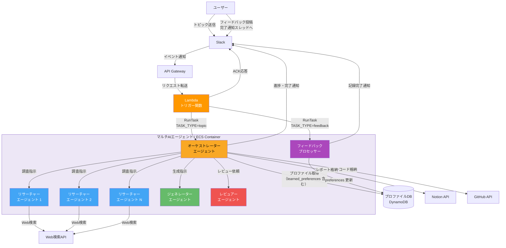
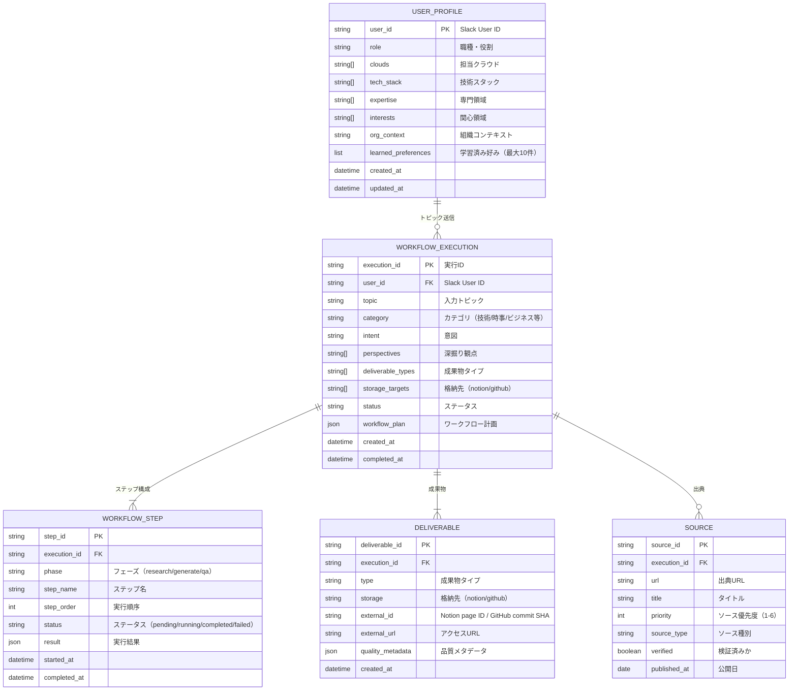
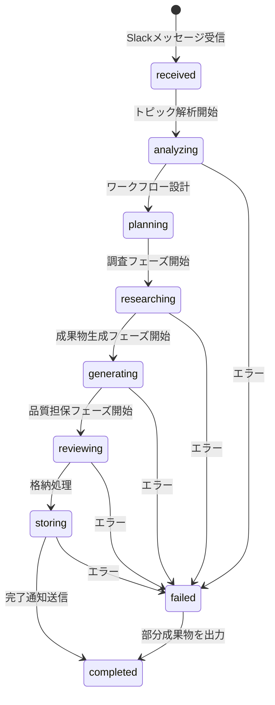
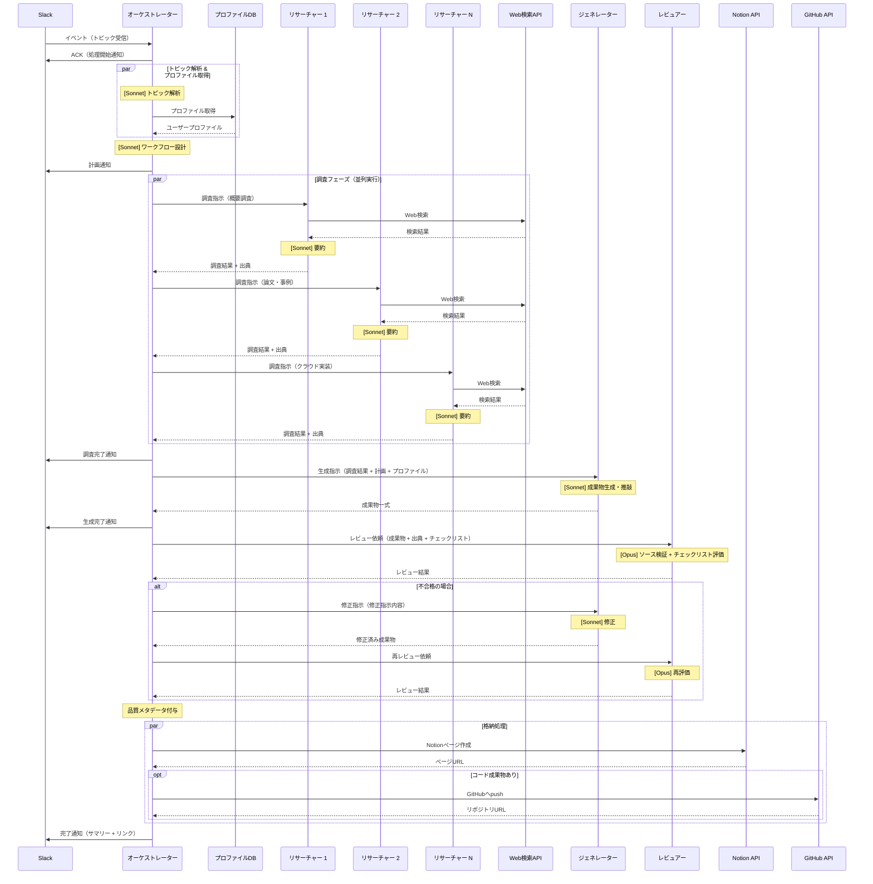
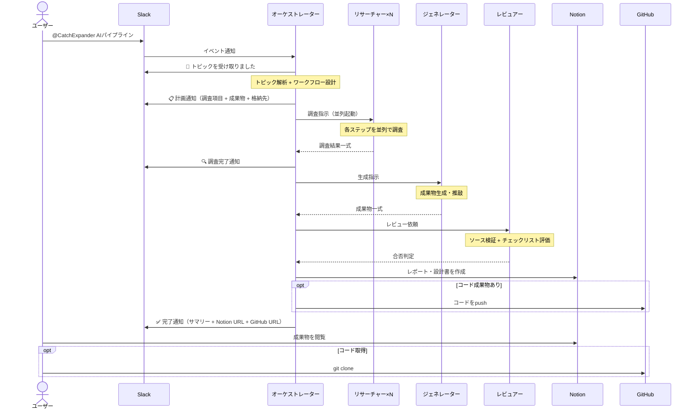
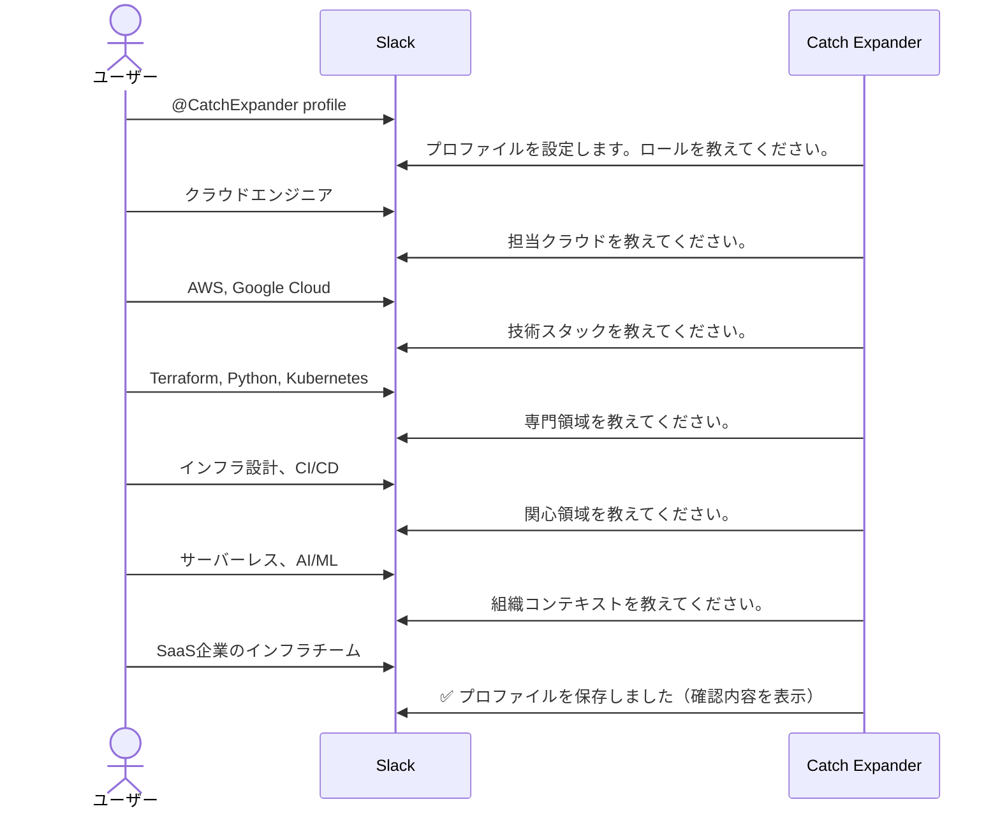

# 機能設計書

## 1. システム全体構成

### システム構成図



### マルチAIエージェント構成

本システムは**マルチAIエージェント構成**を採用する。Claude Code CLI（Maxプラン）をエージェント実行基盤とし、`claude -p` のサブプロセス呼び出し（ThreadPoolExecutorで並列制御）で4種類の専門エージェントが協調して動作する。

選定の詳細は `knowledge/agent-runtime-selection.md` を参照。

```
マルチAIエージェント（ECS Container）
┌─────────────────────────────────────────────────────────┐
│  Claude Code CLI + Claude Sonnet/Opus（Maxプラン）       │
│                                                         │
│  ┌───────────────────────────────────────────────┐      │
│  │ オーケストレーターエージェント（司令塔）        │      │
│  │   - トピック解析・ワークフロー設計              │      │
│  │   - サブエージェントへの指示・結果統合          │      │
│  │   - 進捗通知・格納処理の制御                   │      │
│  └──────────┬────────────┬────────────┬──────────┘      │
│             │            │            │                  │
│  ┌──────────▼──────┐ ┌──▼─────────┐ ┌▼───────────────┐ │
│  │ リサーチャー     │ │ ジェネレー │ │ レビュアー     │ │
│  │ エージェント     │ │ ター       │ │ エージェント   │ │
│  │ ×N（並列実行）  │ │ エージェント│ │                │ │
│  │                 │ │            │ │ 独立した視点で │ │
│  │ 調査ステップ    │ │ 成果物生成 │ │ 品質検証       │ │
│  │ ごとに1つ起動  │ │ ・推敲     │ │                │ │
│  └─────────────────┘ └────────────┘ └────────────────┘ │
└─────────────────────────────────────────────────────────┘
```

#### エージェント一覧

| エージェント | 役割 | 専門プロンプト | モデル | 並列性 |
|------------|------|--------------|:---:|:---:|
| オーケストレーター | トピック解析、ワークフロー設計、全体制御、格納処理 | 計画立案・判断に特化 | Sonnet | - |
| リサーチャー | Web検索による情報収集・要約・出典記録 | 調査・要約に特化 | Sonnet | 並列（ステップ数分） |
| ジェネレーター | レポート・コード・設計書の生成・推敲 | 文書/コード生成に特化 | Sonnet | 直列 |
| レビュアー | ソース検証・チェックリスト評価・品質メタデータ付与 | 品質検証・ファクトチェックに特化 | **Opus** | 直列 |

#### マルチエージェントの利点

- **調査の並列実行** — リサーチャーエージェントを調査ステップ数分同時に起動し、処理時間を短縮
- **レビューの独立性** — レビュアーエージェントは生成エージェントとは別のコンテキストで動作するため、生成時のバイアスを排除
- **専門性の向上** — 各エージェントが専門のシステムプロンプトを持ち、役割に特化した判断ができる

### コンポーネント一覧

| コンポーネント | 役割 | 実行環境 |
|--------------|------|---------|
| Slack Bot App | ユーザーとのインターフェース（入力受付・通知） | Slack |
| API Gateway | Slackイベントの受信・ルーティング | API Gateway |
| トリガー関数 | Slack署名検証、ACK応答、ECSタスク起動、フィードバック検出 | Lambda |
| オーケストレーターエージェント | トピック解析、ワークフロー設計、全体制御（learned_preferences 反映） | ECS Container（Claude Code CLI） |
| リサーチャーエージェント（×N） | Web検索による情報収集・要約 | ECS Container（Claude Code Agentツール） |
| ジェネレーターエージェント | 成果物の生成・推敲 | ECS Container（Claude Code Agentツール） |
| レビュアーエージェント | ソース検証・セルフレビュー・品質メタデータ付与 | ECS Container（Claude Code Agentツール） |
| フィードバックプロセッサー | フィードバック解析・preferences 抽出・プロファイル更新（TASK_TYPE=feedback） | ECS Container（Claude Code CLI） |
| プロファイルDB | ユーザープロファイルの永続化（learned_preferences 含む） | DynamoDB |
| Claude Sonnet 4.6 / Opus 4.6 | 全エージェントの推論エンジン（Sonnet: 通常ステップ、Opus: 品質レビューのみ） | Maxプラン（Claude Code CLI経由） |
| Web検索 | インターネット情報の検索 | Claude Code組み込み（WebSearch/WebFetch） |
| Notion API | 成果物ページの作成・更新 | 外部API |
| GitHub API | コード成果物のpush | 外部API |

## 2. データモデル

### ER図



### ステータス遷移



## 3. コンポーネント設計

### 3.1 オーケストレーターエージェント

全体の司令塔。トピック解析・ワークフロー設計を自ら行い、サブエージェントに指示を出し、結果を統合する。



#### 状態管理

オーケストレーターはワークフロー実行の状態をDynamoDBに永続化する。コンテナの異常終了時に再開可能にするため。

```
WORKFLOW_EXECUTION レコード:
{
  "execution_id": "exec-20260404-001",
  "user_id": "U12345",
  "topic": "AIパイプライン",
  "status": "researching",
  "workflow_plan": {
    "research_steps": [...],
    "generate_steps": [...],
    "qa_steps": [...]
  },
  "current_step": 3,
  "slack_channel": "D12345",
  "slack_thread_ts": "1712234567.000100"
}
```

#### エージェント間通信

オーケストレーター（Pythonプロセス）は `claude -p <プロンプト> --output-format json` を `subprocess.run` で呼び出す。リサーチャーは `ThreadPoolExecutor` で並列起動し、ジェネレーター・レビュアーは直列で順次呼び出す。各呼び出しは独立したClaude Codeセッションとなり、専門プロンプトをプロンプトの先頭に埋め込むことで専門コンテキストを実現する。

```
orchestrator.py（Pythonプロセス）
  │
  ├── subprocess call_claude(リサーチャープロンプト + "概要調査指示")   ─┐
  ├── subprocess call_claude(リサーチャープロンプト + "論文・事例調査") ─┤ 並列
  ├── subprocess call_claude(リサーチャープロンプト + "クラウド実装調査")─┘
  │          （ThreadPoolExecutorで並列実行）
  │
  ├── 全リサーチャーの結果を統合
  │
  ├── subprocess call_claude(ジェネレータープロンプト + 調査結果 + 計画)
  │          ↓ code_filesがnullの場合
  ├── subprocess call_claude(コード生成専用プロンプト)  ← 追加フォールバック
  │
  ├── subprocess call_claude(レビュアープロンプト + 成果物, model="opus")
  │
  └── (不合格なら修正→再レビュー、最大2回)
```

### 3.2 リサーチャーエージェント

調査専門のサブエージェント。調査ステップごとに1つ起動され、**並列で同時実行**される。

#### 専門プロンプト
- 調査・要約に特化したシステムプロンプト
- ソース優先順位ルールを含む
- 出典URLの記録を必須とする指示

#### 処理フロー

```
入力: オーケストレーターからの調査指示
  （ステップ定義、検索ヒント、カテゴリ、ソース優先順位）
  ↓
1. [Sonnet] 検索クエリを生成（ステップ定義→検索キーワード）
  ↓
2. Claude Code組み込みのWebSearch/WebFetchで検索実行
  ↓
3. [Sonnet] 検索結果からソース優先順位に基づき関連ページを選択
  ↓
4. [Sonnet] ページ内容を取得・要約
  ↓
5. 出典情報（URL、タイトル、公開日、ソース種別）を記録
  ↓
出力: オーケストレーターへ返却
  （要約テキスト + 出典リスト）
```

#### 並列実行

```
例: 5つの調査ステップ

  シングルエージェント（直列）:
    概要 → 論文 → ユースケース → クラウド実装 → コスト = 5ステップ分の時間

  マルチエージェント（並列）:
    概要 ─────┐
    論文 ─────┤
    ユースケース ┤ → 全完了 = 最も遅いステップ1つ分の時間
    クラウド実装 ┤
    コスト ────┘
```

### 3.3 ジェネレーターエージェント

成果物生成専門のサブエージェント。全調査結果を受け取り、成果物を生成・推敲する。

#### 専門プロンプト
- 文書生成・コード生成に特化したシステムプロンプト
- 成果物タイプ別の構造化ルールを含む
- ユーザープロファイルに基づくカスタマイズ指示

#### 処理フロー

```
入力: オーケストレーターからの生成指示
  （調査結果一式 + ワークフロー計画 + ユーザープロファイル）
  ↓
1. [Sonnet] 下書き生成
   - 調査結果を成果物タイプごとに整理
   - ユーザープロファイルに基づくカスタマイズ
  ↓
2. [Sonnet] 推敲
   - 全体の整合性確認
   - 表現の改善
   - 出典URLの挿入
  ↓
出力: オーケストレーターへ返却
  （成果物一式：レポート、コード、設計書等）
  ※ code_filesがnullの場合、オーケストレーターがコード専用の追加呼び出しを実施
```

#### 成果物タイプ別の生成仕様

**テキスト成果物**
- Notion APIのブロック形式で生成（heading, paragraph, bulleted_list, table, code等）
- Mermaid図は`/mermaid`ブロックとして生成

**コード成果物**
- ファイル単位で生成（main.tf, variables.tf等）
- 各ファイルにコメントで説明を付与
- README.mdに使用手順を記載
- GitHub APIでリポジトリにpushする形式で出力

### 3.4 レビュアーエージェント

品質検証専門のサブエージェント。ジェネレーターとは**独立したコンテキスト**で動作し、生成時のバイアスを排除する。

#### 専門プロンプト
- 品質検証・ファクトチェックに特化したシステムプロンプト
- カテゴリ別チェックリストを含む
- 批判的・客観的な視点での評価を指示

#### 処理フロー

```
入力: オーケストレーターからのレビュー依頼
  （成果物一式 + 出典リスト + カテゴリ別チェックリスト）
  ↓
[第1層: ソース検証]
1. 出典URLにHTTPリクエストを送信し、実在を確認
2. [Opus] 取得したページ内容と成果物の記述を照合
3. 未検証の事実主張を検出しマーク付与
  ↓
[第2層: チェックリスト評価]
4. [Opus] カテゴリ別チェックリストで各項目を評価
5. 不合格項目に対して具体的な修正指示を生成
  ↓
[第3層: 品質メタデータ生成]
6. 検証ステータス、情報鮮度、レビュー結果を集約
7. 品質メタデータを構成
  ↓
出力: オーケストレーターへ返却
  （合否判定 + 修正指示 + 品質メタデータ）
  ※ レビュアーのみ Claude Opus を使用（最高品質の独立検証のため）
```

#### レビューループ

```
ジェネレーター → 成果物 → レビュアー → 不合格
                   ↑                      │
                   └── 修正指示 ←─────────┘
                        （最大2回、実装しながら調整）
```

レビュアーとジェネレーターは別のコンテキストで動作するため、ジェネレーターが「自分の出力は正しい」と思い込むバイアスを排除できる。

## 4. 外部連携設計

### 4.1 Slack連携

#### イベント処理

| イベント | トリガー | 処理 |
|---------|---------|------|
| `app_mention` | チャンネルでメンション | トピック受信→ワークフロー開始 |
| `message.im` | Bot宛てDM | トピック受信→ワークフロー開始 |

#### Slack Bot コマンド

| コマンド | 機能 |
|---------|------|
| `@CatchExpander <トピック>` | トピック送信 |
| `@CatchExpander profile` | プロファイル登録・更新（対話形式） |
| `@CatchExpander status` | 実行中のワークフロー状況確認 |

#### メッセージ構成

進捗通知と完了通知はSlackのスレッド内に投稿する。

```
[メインメッセージ] 📨 トピックを受け取りました。
  └── [スレッド] 📋 計画通知
  └── [スレッド] 🔍 進捗通知 × N
  └── [スレッド] ✅ 完了通知（サマリー + リンク）
```

### 4.2 Notion連携

#### 成果物DB構造

```
Database: Catch Expander 成果物
Properties:
  - タイトル (title): トピック名
  - カテゴリ (select): 技術 / 時事 / ビジネス / 学術 / カルチャー
  - 日付 (date): 作成日
  - ステータス (select): 作成中 / 完了
  - GitHub URL (url): コード成果物のリポジトリURL（該当時のみ）
  - Slack User (rich_text): リクエスト元ユーザー
```

#### ページ構成

成果物ページのセクション構成はエージェントが自律的に決定するが、以下の共通構造を持つ。

```
[ページタイトル] トピック名

[共通セクション]
├── 各成果物セクション（エージェントが決定）
│   ├── 調査レポート
│   ├── 設計書（該当時）
│   ├── 比較表（該当時）
│   ├── コード成果物へのリンク（該当時）
│   └── ...
├── まとめと推奨アクション
├── 出典一覧（全出典URLをリスト）
└── 品質情報（品質メタデータ）
```

#### Notion API操作の安全設計

| 操作 | API | 許可 |
|------|-----|:---:|
| ページ作成 | POST /pages | o |
| 自身作成ページの更新 | PATCH /pages/{id}, PATCH /blocks/{id} | o（execution_id照合） |
| 完了済みページの更新 | PATCH /pages/{id} | x（ステータスチェック） |
| ページ削除 | DELETE /blocks/{id} | x（呼び出さない） |
| DB構造の変更 | PATCH /databases/{id} | x（呼び出さない） |

#### 実装上の制約・仕様

- **100ブロック上限**: Notion APIの `append_block_children` は1リクエストあたり100ブロックが上限。`create_page()` は `content_blocks` を100ブロック単位に分割してチャンク投稿する。
- **`create_page()` 戻り値**: `tuple[str, str]`（`page_url, page_id`）を返す。`page_id` はステータス更新（`update_page_status()`）に使用する。
- **出典のURL重複排除**: `put_sources()` はURLをキーに重複を除去し、各エントリに新規UUIDの `source_id` を付与してからDynamoDB `batch_writer()` で一括登録する。

### 4.3 GitHub連携

#### リポジトリ構成

```
catch-expander-code/              # コード成果物専用リポジトリ（Private）
├── ai-pipeline-20260404/
│   ├── README.md
│   ├── aws/
│   │   ├── main.tf
│   │   ├── variables.tf
│   │   └── outputs.tf
│   └── gcp/
│       ├── main.tf
│       ├── variables.tf
│       └── outputs.tf
├── ecs-autoscaling-20260410/
│   ├── README.md
│   └── ...
└── ...
```

#### GitHub API操作

| 操作 | API | 用途 |
|------|-----|------|
| ファイル作成・更新 | PUT /repos/{owner}/{repo}/contents/{path} | コード成果物のpush |
| README作成 | PUT /repos/{owner}/{repo}/contents/{path}/README.md | 概要 + Notionリンク |

- Fine-grained PATで `contents: write` 権限のみ付与
- ブランチ: `main` に直接push（成果物リポジトリのためPR不要）

### 4.4 Claudeモデル連携（Maxプラン + Claude Code CLI）

#### モデルとプラン

| 項目 | 内容 |
|------|------|
| モデル（通常ステップ） | Claude Sonnet 4.6 |
| モデル（品質レビュー） | Claude Opus 4.6 |
| プラン | Maxプラン（月額固定） |
| アクセス方式 | Claude Code CLI（Anthropic公式アプリケーション） |
| 認証 | MaxプランOAuth（Claude Codeの想定された利用方法） |
| 選定理由 | レビュアーは独立した高品質判断が必須なためOpusを使用。それ以外はSonnetで速度とコストを最適化。Maxプランで固定コスト化。 |

#### Claude Code CLIの実行方法

```bash
# 通常ステップ（Sonnet）
claude -p "プロンプト" --model sonnet --output-format json

# 品質レビュー（Opus）
claude -p "プロンプト" --model opus --output-format json

# ツール制限（必要に応じて）
claude -p "プロンプト" --model sonnet --allowedTools "WebSearch,WebFetch,Read,Write,Bash"
```

#### 呼び出し一覧（エージェント別）

| エージェント | # | 呼び出し | モデル | 入力 | 出力 |
|------------|---|---------|:---:|------|------|
| オーケストレーター | 1 | トピック解析 | Sonnet | トピックテキスト | JSON（カテゴリ、意図、観点リスト） |
| オーケストレーター | 2 | ワークフロー設計 | Sonnet | 解析結果 + プロファイル | JSON（ステップリスト、成果物タイプ） |
| リサーチャー（×N） | 3 | 調査要約 | Sonnet | 検索結果テキスト | 要約テキスト + 出典リスト |
| ジェネレーター | 4 | 成果物生成（下書き→推敲） | Sonnet | 調査結果 + 計画 + プロファイル | 成果物テキスト/コード |
| ジェネレーター | 4b | コード成果物独立生成（code_filesがnullの場合のみ） | Sonnet | 調査結果 + code_types | `{"files": {...}, "readme_content": "..."}` JSON |
| レビュアー | 5 | ソース検証 + チェックリスト評価 | **Opus** | 成果物 + 出典 + チェックリスト | JSON（合否判定、修正指示） |
| ジェネレーター | 6 | 修正（0〜2回） | Sonnet | 成果物 + 修正指示 | 修正済み成果物 |
| レビュアー | 7 | 再レビュー（0〜2回） | **Opus** | 修正済み成果物 + チェックリスト | JSON（合否判定） |

#### 1回のトピック処理あたりの呼び出し数

```
最小（時事トピック・コードなし・レビュー合格）:
  オーケストレーター: 2（解析 + WF設計）      Sonnet
  リサーチャー×N:    N（並列実行だが呼び出し数は同じ） Sonnet
  ジェネレーター:    1（生成）                 Sonnet
  レビュアー:       1（レビュー）              Opus
  合計: N + 4

標準（技術トピック・コード生成あり・レビュー合格）:
  上記 + コード独立生成 1回（Sonnet）
  合計: N + 5

最大（技術トピック・コード生成あり・修正2回）:
  オーケストレーター: 2                        Sonnet
  リサーチャー×N:    N                         Sonnet
  ジェネレーター:    1 + 1 + 2（生成 + コード + 修正2回） Sonnet
  レビュアー:       1 + 2（レビュー + 再レビュー2回）    Opus
  合計: N + 9
  ※ N = 調査ステップ数（通常3〜5）
```

#### 並列実行による時間短縮

```
直列実行（シングルエージェント）:
  解析 → WF設計 → 調査1 → 調査2 → ... → 調査N → 生成 → レビュー
  所要時間: 全ステップの合計

並列実行（マルチエージェント）:
  解析 → WF設計 → [調査1〜N 並列] → 生成 → レビュー
  所要時間: 調査フェーズが最長1ステップ分に短縮
```

すべてClaude Code CLIプロセス内で実行され、Maxプランの利用枠内で処理される。

## 5. 画面遷移・ユーザーインタラクション

### 5.1 基本フロー（トピック→成果物）



### 5.2 プロファイル登録フロー



## 6. F8 フィードバック学習

### フロー概要

```
[ユーザー] 完了通知スレッドにフィードバックを自由テキストで投稿
      ↓
[Lambda] thread_ts で完了済み実行を特定 → ECS起動（TASK_TYPE=feedback）
      ↓
[ECS / FeedbackProcessor] Claude がフィードバックを解析 → preferences 抽出
      ↓
[DynamoDB] user-profiles の learned_preferences を更新（最大10件）
      ↓
[Slack] 記録された好みの一覧を同スレッドに通知
      ↓
[次回トピック処理] オーケストレーターが learned_preferences を読んでプロンプトに反映
```

### フィードバック検出ロジック（Lambda）

| 条件 | 動作 |
|------|------|
| スレッド返信 + 対応する完了済み実行あり（`status == "completed"`） | フィードバックルート：ACK投稿 → ECS起動（`TASK_TYPE=feedback`） |
| スレッド返信 + 実行レコードはあるが `status != "completed"` | 無視（HTTP 200 のみ） |
| スレッド返信 + 実行レコードなし | 新規トピックとして既存フローへ fall through |
| スレッドなし（トップレベル投稿）| 新規トピックとして既存フロー |

フィードバック検出は既存の `user-id-index` GSI（PK: `user_id`）と `slack_thread_ts` フィールドを流用する。新規 AWS リソースは追加しない。

### FeedbackProcessor コンポーネント

```
src/agent/feedback/
└── feedback_processor.py
    ├── process()               # メインエントリーポイント
    ├── _build_extraction_prompt()  # Claude への入力プロンプト構築
    └── _merge_preferences()    # 好みリストのマージ（最大10件、古い順削除）
```

`FeedbackProcessor` は `call_claude` / `_parse_claude_response`（`orchestrator.py`）を再利用する。

### learned_preferences フィールド仕様

`user-profiles` テーブルに追加される `learned_preferences` フィールドのフォーマット：

```json
"learned_preferences": [
  {
    "text": "Terraformコードはmoduleを分割してディレクトリ構造で管理する",
    "created_at": "2026-04-12T12:34:56.789Z"
  }
]
```

- 最大10件。超過時は先頭（最古）から削除
- スキーマレスのため既存レコードへの影響なし（未存在フィールドは空リストとして扱う）

### 生成プロンプトへの反映（Orchestrator）

`Orchestrator.run()` の `profile_text` 構築時に `learned_preferences` を末尾に追記する。
この1ヶ所の変更でトピック解析・ワークフロー設計・生成の3プロンプトすべてに反映される。

```
## ユーザーの蓄積された好み（学習済み）
以下の好みを成果物の生成方針に必ず反映してください：
- Terraformコードはmoduleを分割してディレクトリ構造で管理する
- 説明は箇条書きで要点のみ、本文を長くしない
```

`learned_preferences` が空の場合はセクション自体を追記しない（既存動作を維持）。

## 7. エラーハンドリング

### エラー種別と対応

| エラー | 発生箇所 | 対応 |
|--------|---------|------|
| Slack署名検証失敗 | API Gateway | 403を返す。ログ記録 |
| Opus呼び出し失敗 | Claude Code CLI | 最大3回リトライ。全失敗時はエラー通知 |
| Maxプラン利用上限到達 | Claude Code CLI | エラー通知＋次回利用可能時間を案内 |
| Web検索失敗 | リサーチャー（WebSearch/WebFetch） | 該当ステップをスキップし、他のステップの結果で継続 |
| Notion API失敗 | 格納処理 | 最大3回リトライ。全失敗時はSlackにエラー通知＋成果物テキストをSlackに直接投稿 |
| GitHub API失敗 | 格納処理 | 最大3回リトライ。全失敗時はコードをNotionのコードブロックに格納（フォールバック） |
| コンテナ異常終了 | ECS | 状態をDynamoDBに保存しており、コンテナ再起動後に再開 |

### 部分成果物の出力

一部のステップが失敗しても、成功したステップの結果で部分的な成果物を出力する。

```
例: 5つの調査ステップのうち、ステップ3が失敗

出力:
  - ステップ1, 2, 4, 5の結果を元に成果物を生成
  - 品質メタデータに「ステップ3（ユースケース調査）が失敗したため、
    ユースケースのセクションは含まれていません」と記載
  - Slack通知に⚠️マークで失敗を明示
```
